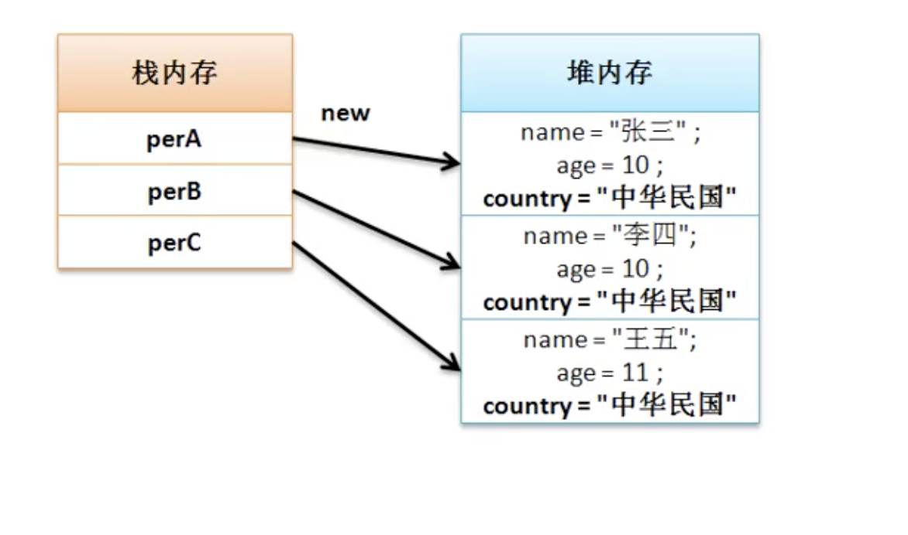
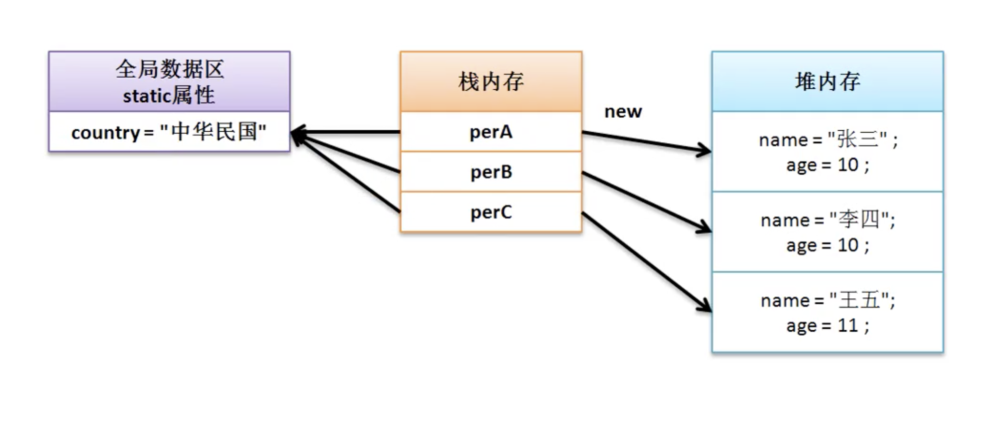
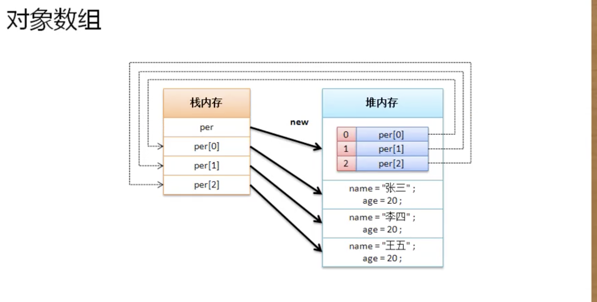

# JAVA 基础学

## 1.数据类型

* Java语言提供了八种基本类型。六种数字类型（四个整数型，两个浮点型），一种字符类型，还有一种布尔型。

```java
byte：
byte 数据类型是8位、有符号的，以二进制补码表示的整数；
最小值是 -128（-2^7）；
最大值是 127（2^7-1）；
默认值是 0；
byte 类型用在大型数组中节约空间，主要代替整数，因为 byte 变量占用的空间只有 int 类型的四分之一；
例子：byte a = 100，byte b = -50。

short：
short 数据类型是 16 位、有符号的以二进制补码表示的整数
最小值是 -32768（-2^15）；
最大值是 32767（2^15 - 1）；
Short 数据类型也可以像 byte 那样节省空间。一个short变量是int型变量所占空间的二分之一；
默认值是 0；
例子：short s = 1000，short r = -20000。

int：
int 数据类型是32位、有符号的以二进制补码表示的整数；
最小值是 -2,147,483,648（-2^31）；
最大值是 2,147,483,647（2^31 - 1）；
一般地整型变量默认为 int 类型；
默认值是 0 ；
例子：int a = 100000, int b = -200000。

long：
long 数据类型是 64 位、有符号的以二进制补码表示的整数；
最小值是 -9,223,372,036,854,775,808（-2^63）；
最大值是 9,223,372,036,854,775,807（2^63 -1）；
这种类型主要使用在需要比较大整数的系统上；
默认值是 0L；
例子： long a = 100000L，Long b = -200000L。
"L"理论上不分大小写，但是若写成"l"容易与数字"1"混淆，不容易分辩。所以最好大写。

float
float 数据类型是单精度、32位、符合IEEE 754标准的浮点数；
float 在储存大型浮点数组的时候可节省内存空间；
默认值是 0.0f；
浮点数不能用来表示精确的值，如货币；
例子：float f1 = 234.5f。

double
double 数据类型是双精度、64 位、符合IEEE 754标准的浮点数；
浮点数的默认类型为double类型；
double类型同样不能表示精确的值，如货币；
默认值是 0.0d；
例子：double d1 = 123.4。

boolean：
boolean数据类型表示一位的信息；
只有两个取值：true 和 false；
这种类型只作为一种标志来记录 true/false 情况；
默认值是 false；
例子：boolean one = true。

char：
char类型是一个单一的 16 位 Unicode 字符；
最小值是 \u0000（即为0）；
最大值是 \uffff（即为65,535）；
char 数据类型可以储存任何字符；
例子：char letter = 'A';。

```

## 2.逻辑控制

* if...else... , switch , while , for

```java

//if..else...
if(表达式)else{}

// switch伪代码
switch( [ String, Char, int, 枚举类型 ] ){
    case 条件:
    break ;
    default:
    break;
}

//while do...while
while(表达式){}

do{}while(表达式);

// 循环控制
break；
continue；

```

## 3.方法

* 在主类中定义并由主类调用的方法

```java
public static 返回值类型[无返回值用void] 方法名 ([参数类型 变量名,....]){
    ...
    [return [返回值];]
}

```

* 方法重载
  * 方法名称必须相同。

  * 参数列表必须不同。

  * 方法的返回类型可以相同也可以不相同。

  * 仅仅返回类型不同不足以称为方法的重载。

```java
public class Demo {
    //一个普通得方法，不带参数，无返回值
    public void add(){
        //method body
    }

    //重载上面的方法，并且带了一个整形参数，无返回值
    public void add(int a){
        //method body
    }

    //重载上面的方法，并且带了两个整型参数，返回值为int型
    public int add(int a,int b){
        //method body
        return 0;
    }

```

## 4.面向对象

* 封装性

* 继承性

* 多态性（多种数据类型）

```java

OOA:面向对象分析
OOD:面向对象设计
OOP:面向对象编程

```

### 4.1对象的定义

* 声明并实例化对象：类名称 对象名称 = new 类名称()；
* 分步完成
  * 类名称 对象名称 = null ;
  * 对象名称 = new 类名称();
* 对象调用
  * 对象.属性；
  * 对象.方法()；

```java

class Person {
    String name;
    int age;
    public void say(){
        System.out.println("name="+name+" age="+ age);
    }
}

public class JavaDemo {
    public static void main(String[] args){
        //声明并实例化对象
        Person person = new Person();
        person.say();//name=null age=0
        person.name = "张三";
        person.age = 18;
        person.say();//name=张三 age=18
        //方法二
        Person person1 = null;
        person1 = new Person();
    }
}

```

### 4.2对象与内存分析

* <font color='red'>堆内存：保存对象的具体信息，在程序中堆内存的空间开辟是通过new完成的</font>

* <font color='red'>栈内存：保存一块堆内存的地址，即通过地址找到堆内存，而后找到对象内容。基本类型也保存在栈内存中</font>

<!--  -->

### 4.3内存的引用传递

* 同一块堆内存可以被不同的栈内存引用，也可以更换引用的栈内存

### 4.4 类成员属性的封装

* 在类外部可以调用并赋值。会造成属性不安全，需要室使用<font color='red'><b>private</b></font>关键字对属性进行封装处理.
* 属性封装后外部不能直接访问,对类的内部是可见的.
* 使用 <font color='red'><b>setter</b></font>或<font color='red'><b>getter</b></font>方法。

  * 设置属性 setXxx();例如 public Void setName(String n);
  * 获取属性 getXxx();例如 public getName()；
* <font color='red'><b>类中的大部分属性都要用private封装，需要访问就要有setter和getter方法。</b></font>

```java

//未封装
public class Person{
    String name;
    int age;
    public void tell(){
        System.out.print("name="+name+" age="+age);
    };
}

public class JavaDemo{
    //主函数
    public static void main(String[] args){
        Person person = new Person();
        person.name = "张三";
        person.age = 18;
        person.tell();
    }
}

// 使用private封装

class Person1 {
	private String name;
	private int age;

	public void setName(String a) {
		name = a;
	};

	public void setAge(int age1) {
		age = age1;
	};

	public String getName() {
		return name;
	};

	public int getAge() {
		return age;
	};

	public void tell() {
		System.out.print("name=" + name + " age=" + age);
	};
}

public class JavaDemo{
    //主函数
    public static void main(String[] args){
        Person person1 = new Person1();
        person1.setName("张三");
        person1.setAge(18);
        person1.tell();
    }
}

```

### 4.5构造方法与匿名对象

* 构造方法：<font color='red'>可以通过构造方法实现实例化对象中的属性初始化</font>

* java中的构造方法：
  * 构造方法名称必须与类名称保持一致。
  * 构造方法不允许设置任何返回值类型，即:没有返回值定义
  * 构造方法是在使用关键字new实例化对象时自动调用的

* 构造方法重载，可以按照参数的个数排列。
* 构造方法是实例化时候初始属性值，setter可以设置属性值也可以修改属性值

* 构造方法为什么不允许设置任何返回值类型或viod
  * 如果有void或返回值结构就与普通函数完全相同，编译器无法区分,构造方法与普通方法最大的区别在于，一个是实例化时候调用，一个是实例化后调用。

```java

class Person {
    private String name;
    private int age;
    // 方法名称与类名称相同
    public Person(String n , int a){//定义有参构造
        name = n;
        age = a;
    };
    public static void tell(){
        System.out.println("hello");
    };
    public String getName() {
        return name;
    }
}

public class JavaDemo{
    public static void main(String[]arg){
        Person per = new Person("ZhangSan",14);
        per.getName()//ZhangSan
    }
}

```

* 匿名对象：使用一次后，将被GC回收♻️。
* 只要是方法就可以传递任意数据类型。

```java
new Person("李四",18).getName();//李四
```

## 5.this关键字

* this上下文执行环境
  * 当前类中的属性：this.属性；
  * 当前类中的方法：this.方法名()，this()调用构造方法;
  * this描述当前的对象

```java

class Person{
    private String name;
    private int age;
    public void setName(String namen){
        this.name=name;
    };
    public String getName(){
        return this.name;
    };

    public Person(String name, int age){
        this.setName(name);//this.name = name;
        this.age = age;
    };

}

public class JavaDemo{
    public static void main(String[]arg){
        Person per = new Person("张三",12);
    }
}

```

* this()的使用。实现代码复用。如多构造函数中.
  * 构造方法必须在实例化新对象的时候调用，所以this()的语句只允许出现在构造方法的首行。

```java

class Person{
    private String name;
    private int age;

    //无参数
    public Person(){
        System.out.println("一个新的实例对象生成");
    };

    // 单参数
    public Person(String name){
        this();//调用无参数
        this.name = name;
    };
    // 双参数
    public Person(String name, int age){
        this(name);//调用单参数
        this.age = age;
    };

    public void setName(String namen){
        this.name=name;
    };
    public String getName(){
        return this.name;
    };


}

public class JavaDemo{
    public static void main(String[]arg){
        Person per = new Person("张三",12);
    }
}

```

```java
//联系构造方法互相调用
class Emp{
    private String empName;
    private int empNo;
    private String empGroup;
    private double empSalary;

    public Emp(){
        this("无名氏",1000,null);
    }

    public Emp(String empName, int empNo, String empGroup){
        this(enpName,empNo,empGroup,2500.00);
    }

    public Emp(Sting empName, int empNo, String empGroup, double empSalary ){
        this.empName = empName;
        this.empNo = empNo;
        this.empGroup = empGroup;
        this.empSalary = empSalary;
    }

}

```

## 6. 简单java类

* 简单java类：可以描述一类信息的程序类。并且在这个类中没有复杂的逻辑操作，只作为一种信息的存储媒介。
  * 类名称一定要有意义，可以明确描述某一类事物。
  * 类中的所有属性必须使用privatej进行封装，同时封装后必须要有getter和setter方法。
  * 类之中可以有多个构造方法，必须要有无参构造方法。
  * 类之中不允许出现任何输出内容。
  * 非必须 : 可以提供一个获取对象详细信息方法，暂定方法名为getInfo()。

```java

class Dept { //类名称描述明确的某类事物
    private long deptno;
    private String deptname;
    private String loc;
    public Dept(){}//必须要提供有无参构造
    public Dept(long deptno, String deptname, String loc){
        this.deptno = deptno;
        this.deptname = deptname;
        this.loc = loc;
    }
    public void setDeptNo(long deptno){
        this.deptno = deptno ;
    }
    public void setDeptName(String deptname){
        this.deptname = deptname;
    }
    public void setLoc(String loc){
        this.loc = loc;
    }
    public long getDeptNo(){
        return this.deptno;
    }
    public String getDeptName(){
        return this.deptname;
    }
    public String getLoc(){
        return this.loc;
    }
    public String getInfo(){
        return "【部门信息】:"+"部门名称:"+this.deptname+"、部门编号"+this.deptno+"、部门位置"+this.loc;
    }

}

public class JavaDemo{
    public static void main(String [] arg){
        Dept dept = new Dept(12345L,"北京部门","北京");
        System.out.println(dept.getInfo());
    }
}


```

## 7. static、public、private

* public :
    * 具有最大的访问权限，可以访问任何一个在classpath下的类、接口、异常等。它往往用于对外的情况，也就是对象或类对外的一种接口的形式。

* private :

    * 访问权限仅限于类的内部，是一种封装的体现，例如，大多数成员变量都是修饰符为private的，它们不希望被其他任何外部的类访问。

* static :

    * （概念）static表示“全局”或者“静态”的意思，用来修饰成员变量和成员方法，也可以形成静态static代码块，但是Java语言中没有全局变量的概念。

    * （概念）用public修饰的static成员变量和成员方法本质是全局变量和全局方法，当声明它类的对象时，不生成static变量的副本，而是类的所有实例共享同一个static变量。

    * （概念）只要这个类被加载，Java虚拟机就能根据类名在运行时数据区的方法区内找到他们。因此，static对象可以在它的任何对象创建之前访问，无需引用任何对象。 




### 代码块 {}

* 普通块 {}

* 构造块 构造类中的代码块

* 静态块 static {}

## 8.数组

 * 数组：
    * 缺点： 数组长度固定
    * 优点： 数据线性存储，根据索引访问，速度较快，时间复杂度（o）

 * 数组的定义：
    * 数组动态初始化：（声明并初始化数组）
        * 数据类型 数组名 [] = new 数据类型 [数组长度] ;
        * 数据类型 [] 数组名  = new 数据类型 [数组长度] ;
        * 数组每一个元素保存的值为默认值。对象(null),int(0)等
    * 数组静态初始化：在数组定义时就是设置好数组内容
        * 数据类型 数组名 [] = new 数据类型 [] {数据,数据,...};
        * 数据类型 [] 数组名 = {数据,数据,...};

 * 二维数组：
    * 数组定义：
        * 数据类型 数组名 [][] = new 数据类型 [数组行数][数组列数];
        * 数据类型 数组名 [][] = {{数据,...},{数据,...},...}

 * 数组操作
    * length：数组长度
    * 数组元素： 数组名[下标] （下标越界报错）
    * for、foreach循环
        * for: for(int i =0; i<数组名.length; i++){}
        * foreach: for(数据类型 item : 数组名){}

 * 数组相关操作
    * 排序 : 
        * 内置方法 java.util.Array.sort(数组)；
        * 实现int类型数组排序

    ```java

    ```

    * 数组反置：

    ```java
    public class JavaDemo {
        public static void main(String [] arg) {
            int arr1 [] = new int [] {1,2,3,4,5};
            ArrayUtil.printArray(arr1);
            ArrayUtil.reverseArr(arr1);
            ArrayUtil.printArray(arr1);
        }
    }
    //输出结果
    //1、2、3、4、5、
    //5、4、3、2、1、
    //实现方法多种
    class ArrayUtil{
        public static void reverseArr(int arr []) {
            int len = arr.length-1;
            for(int i = 0 ; i <arr.length; i++) {
                if(i>len-i) {
                    break ;
                }
                int temp = arr[i];
                arr[i] = arr[len-i];
                arr[len-i] =temp;
            }
        }
        public static void printArray (int [] arr) {
            for(int item :arr) {
                System.out.print(item+"、");
            }
            System.out.println();
        }
    }
    ```
    * 数组拷贝 ：元素替换
        * System.arraycopy(原数组,原数组开始点,目标数组,目标数组开始点,拷贝长度);

 * 数组参数可变：可以通过方法参数使用...（扩展运算符收集参数，获得参数的数组对象）

```java
    public class JavaDemo{
        public static void main(String arg []){
            //需要传递数组
            ArrayUtil.sum(new int [] {1,2,3});//6
            //使用扩展运算符收集参数的方法，可以传递任意多个参数
            ArrayUtil.sum1(1,2,3);//6


        }
    }
    //sum接收数组
    class ArrayUtil{
        public static int sum(int arr []){
            int sum = 0;
            for(int item : arr){
                sum += item;
            }
            return sum;
        }
        //通过扩展运算符收集参数
        public static int sum1(int ...arr){
            int sum = 0;
            for(int item : arr){
                sum += item;
            }
            return sum;
        }
    }

```

 * 对象数组
    * 动态初始化： 类 数组名 [] = new 类 [数组长度]; 默认值null
    * 静态初始化： 类 数组名 [] = new 类 [] { 实例化对象,...}
    * 列子
    ```java
        public class JavaDem{
            public static void main(String [] arg ){
                Person per [] = new Person [] {
                    new Person("张三",20),
                    new Person("李四",20),
                    new Person("王五",20)
                };
            }
        }

        class Person {
            private String name;
            private int age;
            public Person(){
                this("无名氏",0);
            }
            public Person(String name, int age){
                this.name = name;
                this.age = age;
            }
            public String getInfo(){
                return "name:"+this.name+"、age:"+this.age;
            }
        }
    ```
    * 内存分析
    

## 9.继承

* 面向对象的继承特点：可以扩充已有类的功能。可重用性高。

* 实现继承： extends 
    * class 子类 extends 父类
        * 子类也叫做派生类
        * 父类叫做超类（superClass）

* 继承的基本实现
    * 继承中的主要目的是在于子类可以重用父类的结构，并且也可以实现功能的扩展，子类可以定义更多的内容，更具体的描。
    * 子类实例化对象时默认是自动调用父类构造方法实例化父类对象。
    * super: super()表示子类调用父类构造方法，次方法只允许放在子类构造方法首行，super()只会调用父类无参构造，super(参数)调用有参数构造。
    * super与this都可以调用构造方法，super是子类调用父类构造方法，而this是调用本类的构造方法，两个语句都一定要放在构造方法首行，<strong>两个语句不允许同事出现</strong>

```java
    // 栗子1
    class PersonExtends {
    private String name;
    private int age;
    public void setName(String name){
        this.name = name ;
    }
    public void setAge(int age){
        this.age = age ;
    }
    public void getInfo() {
        System.out.println("name=" + this.name + "、age=" + this.age);
    }
}

class Student extends PersonExtends {
}

public class JavaExtends {
    public static void main(String[] args) {
        Student std = new Student();
        std.setName("ma");
        std.setAge(11);
        std.getInfo();  //name=ma、age=11
    }
}
```

```java
class PersonExtends {
    private String name;
    private int age;

    public PersonExtends(String name, int age) {
    this.name = name;
    this.age = age;
    }

    public void setName(String name) {
        this.name = name;
    }

    public void setAge(int age) {
        this.age = age;
    }

    public void getInfo() {
        System.out.println("name=" + this.name + "、age=" + this.age);
    }
}

class Student extends PersonExtends {
    private String school;

    public void setSchool(String school){
        this.school = school;
    }
    public String getSchool(){
        return this.school;
    }
    public Student(String name, int age, String school) {
        super(name, age); //明确调用父类构造
        this.school = school;
    }
}

public class JavaExtends {
    public static void main(String[] args) {
        Student std = new Student("MA",12,"school");
        // std.setName("ma");
        // std.setAge(11);
        std.getInfo();        //name=MA、age=12
        // std.setSchool("school");
        System.out.println(std.getSchool()); //school
    }

}

```

* 继承限制
    * java中不允许多重继承，只允许多层继承。（不能同时继承多个类，可以顺序继承多层）
        * 多重继承是希望可以同时继承多个类的方法，而面对与多重继承的要求，多层继承将范围限制在同于类中。
        * 多层继承理论上不应该继承三层，过多继承会导致过于复杂，混乱。
        ```java
            class A {};
            class B {};
            class c extends A,B{} //多重继承，不允许

            class A {};
            class B extends A {};
            class C extends B {}; //多层继承
        ```
    * 在定义继承关系时，子类可以继承父类中的所有操作结构。对于私有（private)操作属于隐式继承，对于所有非私有操作属于显示继承。
    ```java
        class PersonExtends {
            private String name;
            private int age;

            public void setName(String name) {
                this.name = name;
            }

            public void setAge(int age) {
                this.age = age;
            }

            public void getInfo() {
                System.out.println("name=" + this.name + "、age=" + this.age);
            }
        }

        class Student extends PersonExtends {
            private String school;

            public void setSchool(String school){
                this.school = school;
            }
            public String getSchool(){
                getInfo(); //调用显示继承的方法
                return this.school;
            }
            public Student(String name, int age, String school) {
                this.school = school;
                setName(name);//调用显示继承的方法
                setAge(age);//调用显示继承的方法
            }
        }

        public class JavaExtends {
            public static void main(String[] args) {
                Student std = new Student("MA",12,"school");
                std.getInfo();
                System.out.println(std.getSchool());
            }

        }
    ```

* 覆写
    * 方法覆写： 当子类定义了与父类方法名称相同，参数类型及个数完全相同，称为方法的覆写。(使用规则类似js原型链，子类没有调用父类方法)
    ```java
        class Channel {
            public void connect(){
                System.out.println("channel 的父类 的链接");
            }
        }

        class DataBaseChannel extends Channel{//子类 连接
            public void connect(){
                System.out.println("DataBaseChannel 进行数据库连接");
            }
        }

        public class JavaDemo {
            public static void main(String [] args ){
                Channel channel = new Channel();
                channel.connect();
                //channel 的父类 的链接
                DataBaseChannel dbChannel = new DataBaseChannel();
                dbChannel.connect();
                //DataBaseChannel 进行数据库连接
            }
        }
    ```
    * 方法覆写后想调用父类的方法，需要使用super调用父类中的覆写方法，为防止调用错误，只要子类调用父类方法时，直接使用super调用
    ```java
        class Channel {
            public void connect(){
                System.out.println("channel 的父类 的链接");
            }
        }

        class DataBaseChannel extends Channel{//子类 连接
            public void connect(){
                super.connect();//调用父类方法
                System.out.println("DataBaseChannel 进行数据库连接");
            }
        }

        public class JavaDemo {
            public static void main(String [] args ){
                Channel channel = new Channel();
                channel.connect();
                //channel 的父类 的链接
                DataBaseChannel dbChannel = new DataBaseChannel();
                dbChannel.connect();
                //channel 的父类 的链接
                //DataBaseChannel 进行数据库连接
            }
        }
    ```
* 覆写方法限制

    * 被覆写的方法不能拥有不父类更为严格的访问控制权限
        * public > default(没有任何关键字)>private
        * 父类public 子类只能使用public定义
        * 父类 default 子类 可以使用public 或default定义
    * private 定义的方法，不会被覆写，private 是私有 不可见。
    * OverLading、Override

|OverLading | Override|
|-----------|---------|
|重载 | 覆写|
|中方法名称相同，方法参数不同 | 方法名称相同，方法参数相同|
|没有权限限制 | 子类不能比父类更严格的权限限制|
|同一个类中 | 继承关系中|
|返回类型没有显示|返回类型一致|

* 属性覆盖
    定义： 当子类定义了与父类相同名称的属性就称为属性覆盖。
    * 没有封装的属性
    ```java
        class Channel {
            String info = "Channel";
            public void connect(){
                System.out.println("channel 的父类 的链接");
            }
        }

        class DataBaseChannel extends Channel{//子类 连接
            String info = "DataBaseChannel";
            public String getParentClassInfo(){
                return super.info;
            }
            public void connect(){
                super.connect();
                System.out.println("DataBaseChannel 进行数据库连接");
            }
        }

        public class JavaDemo01 {
            public static void main(String [] args){
                DataBaseChannel dbChannel = new DataBaseChannel();
                System.out.println(dbChannel.info);
                //DataBaseChannel
                System.out.println(dbChannel.getParentClassInfo());
                //Channel
            }
        }
    ```

    * 封装的属性
        * 父类使用private封装后，子类定义同命属性，相当于子类定义了新的属性。
    
* this 与 super 区别
    |this|super|
    |----|-----|
    |this优先查找当前类，如果当前类中没有，则继续查找父类|直接查找父类|
    |构造方法首行，调用本类构造|构造方法首行，调用父类构造|
    |this可以表示当前对象|super表示父类|

* final关键字
    * 定义： final代表终结器，定义不能够被继承的类，方法，定义常量。
    ```java
        //栗子1
        final class Channel{//不能被继承
        }
        //错误: 无法从最终Channel进行继承
        class DatabaseChannel extends Channel{
        }

        //栗子2
        class Channel{
            public final void connect(){

            }
        }
            //错误: DatabaseChannel中的connect()无法覆盖Channel中的connect()
            //public void connect(){
            //             ^
            //被覆盖的方法为final
        class DatabaseChannel extends Channel{
            public void connect(){
            }
        }
    ```
    * final 定义常量
        * 全局常量 ： public static final
    ```java
        //错误: 无法为最终变量NAME分配值
        //this.NAME = "change";
        class Channel{
            public static final String NAME = "Channel";
            public void connect(){
                this.NAME = "change";
            }
        }
        //常量
        public static void main(String [] args){
            String strA = "abc"; //变量
            String strB = "abcABC";
            String StrC = strA + "ABC";
            System.out.println(strA == strC); //false
        }
        public static void main(String [] args){
            String final strA = "abc";//常量
            String strB = "abcABC";
            String StrC = strA + "ABC";
            System.out.println(strA == strC); //true
        }
    ```

## [注解](md/Annotation注解.md)

## [多态性](md/多态性.md)

## [Object类](md/Object类.md)

## [抽象类的定义与使用](md/抽象类的定义与使用.md)

## [接口的基本定义](md/接口的基本定义.md)

## [接口的定义加强](md/接口的定义加强.md)

## [泛型](md/泛型.md)

## [包装类](md/包装类.md)

## [包](md/包.md)

## [工厂设计模式](md/工厂设计模式.md)

## [代理设计模式](md/代理设计模式.md)

## [抽象类与接口的区别](md/抽象类与接口的区别.md)

## [类图](md/类图.md)

## [枚举](md/枚举.md)

## [异常](md/异常.md)
