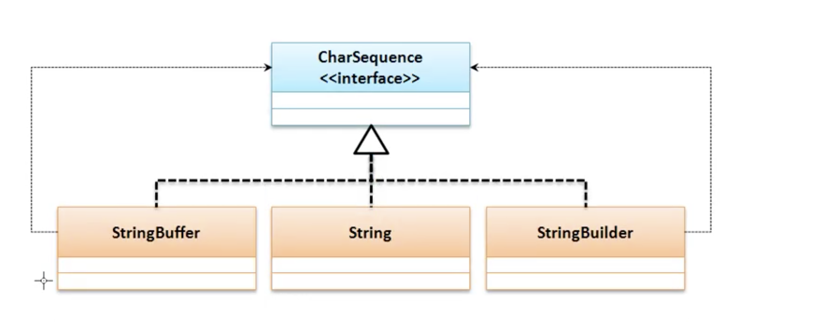
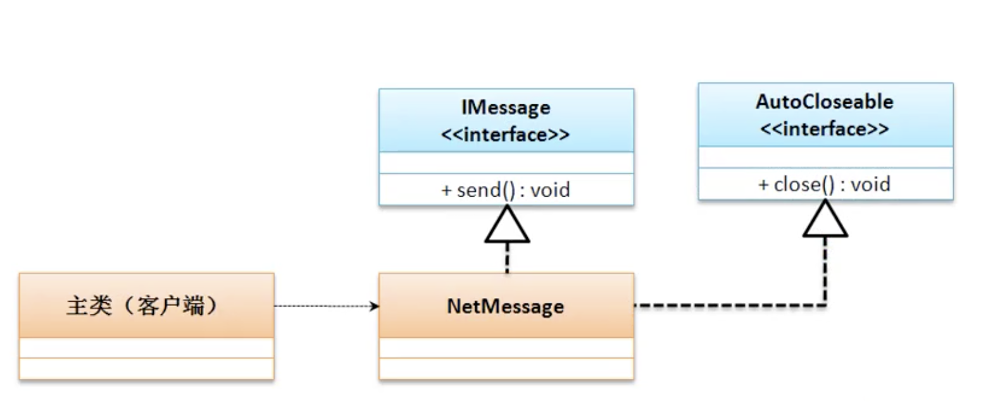
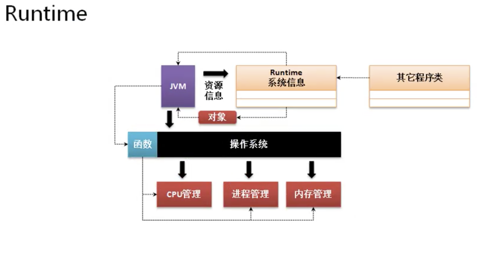

# Java基础类库

## StringBuffer 类

* String类是所有开发中一定会用到的功能类，有如下特点
    * 每一个字符串的常量都属于一个String类的匿名对象，并且不可更改。
    * String有两个常量池：
        * 静态常量池
        * 运行时常量池
    * 实例化最好使用直接量，这样直接可以把对象保存在对象池之中。

* 弊端内容不允许修改，为了解决此问题，提供StringBuffer类。

* <strong>StringBuffer类必须实例化后才可用</strong>
    * 构造方法： public StringBuffer​()
    * 构造方法： public StringBuffer​(String str)
    * 数据追加： public StringBuffer append​(数据类型 数据)；


* String与StringBuffer区别

    * String

    ```java
        public class JavaDemo44 {
            private static String str = "hello";

            public static void main(String[] args) {
                concat(str);
                System.out.println(str); //hello
            }

            private static void concat(String temp) {
                temp += "word";
            }

        }
    ```

    * StringBuffer

    ```java
    public class JavaDemo44 {
        // private static String str = "hello";
        private static StringBuffer buf = new StringBuffer("hello");

        public static void main(String[] args) {
            // concat(str);
            concat(buf);
            // System.out.println(str); //hello
            System.out.println(buf); //hello word
        }

        private static void concat(String temp) {
            temp += "word";
        }
        private static void concat(StringBuffer temp) {
            temp.append( " word");
        }

    }
    ```

* 所有的字符串”+“操作，在编译之后都变成了StringBuffer的append方法

```java

String str = "aa"+"bb"+"cc";

//内部编译运行规则
StringBuffer buf = new StringBuffer();

buf.append("aa").append("bb").append("cc");


```

* String 类对象可以通过StringBuffer的构造方法或者append方法变成StringBuffer对象

* 所有的对象都可以通过toString方法变成String类型。

* StringBuffer 中具有一些String没有的方法

    * 插入数据 ： public StringBuffer insert​(int offset, 数据类 b)
    * 删除指定范围： public StringBuffer delete​(int start, int end)
    * 字符串内容翻转： public StringBuffer reverse​()

* 与StringBuffer类有一个类似的功能类 StringBuild类，这个类是jdk1.5之后提供的，该类中提供的方法与StringBuffer功能相同。

    * StringBuffer的方法都有synchronized ，属于线程安全的

    * StringBuild的方法没有synchronized ，属于非线程安全的

* String、StringBuffer、StringBuild的区别？
    * String类是字符串首选类型，最大的特点是其内容不允许修改。
    * StringBuild 与 StringBuffer类的内容允许修改。
    * StringBuffer是在jdk1.0提供的，属于线程安全的操作。
    * StringBuild 是在jdk1.5提供的，属于非线程安全的操作。

## CharSequence接口

* CharSequence是一个描述字符串结构的接口。这个接口有三种一般常用的子类：



| String类                                                                                           | StringBuffer类                                                                       | StringBuild类                                                                        |
|----------------------------------------------------------------------------------------------------|--------------------------------------------------------------------------------------|--------------------------------------------------------------------------------------|
| public final class String extends Object implements Serializable, Comparable<String>, CharSequence | public final class StringBuffer extends Object implements Serializable, CharSequence | public final class StringBuffer extends Object implements Serializable, CharSequence |

* 可以发现只要有字符串就可以给charSequence接口实例化

```java
   public static void main(String[] args) {
        CharSequence str = "abc"; //子类实例向父接口转型
    }

```

* CharSequence是一个接口，在该接口中也有一些操作方法。（jdk1.4）
    * 获取指定索引字符： char charAt​(int index)
    * 获取字符串的长度： int length​()
    * 截取部分字符串： CharSequence subSequence​(int start, int end)

* CharSequence描述的就是一个字符串

## 第7章 » 课时28 AutoCloseable接口

* AutoCloseable接口主要是用于进行资源开发处理的，以实现资源的自动关闭。例如网络、数据库、文件开发过程之中，由于服务器资源有限，所以使用之后一定要关闭资源。

* 为了实现自动关闭资源，在jdk1.7之后推出了AutoCloseable接口，并且该接口只提供一个方法

    * void close​() throws Exception



* 要想实现自动关闭处理实现AutoCloseable接口外还要结合异常处理语句完成

```java

interface IMessage {
    public void send();
}

class SendMessage implements IMessage, AutoCloseable {

    private String msg;

    public SendMessage(String msg) {
        this.msg = msg;
    }

    public Boolean open() {
        System.out.println("【OPEN】链接成功");
        return true;
    }

    @Override
    public void send() {
        if (this.open()) {
            System.out.println("【SEN】发送消息");
        }
    }

    @Override
    public void close() throws Exception {
        System.out.println("【CLOSE】关闭通道");
    }
}

public class JavaDemo45 {
    public static void main(String[] args) {
        try (SendMessage msg = new SendMessage("msg")) {
            msg.send();
        } catch (Exception e) {
        }
        // 【OPEN】链接成功
        // 【SEN】发送消息
        // 【CLOSE】关闭通道
    }
}
```

## 第7章 » 课时29 Runtime类

* 描述的是运行时的状态，在整个JVM中Runtime是唯一一个与JVM运行状态有关的类。并且都会默认提供有一个该类的实例化对象。

    * public class Runtime extends Object

* 由于在每一个JVM进程里只允许提供有一个Runtime类对象，所有构造方法私有化。那么就可以确定该类是单例设计模式，单例设计模式一定会提供有一个static方法获取实例。



* Runtime中的方法
<strong>
    * 获取实例化对象：public static Runtime getRuntime​()
    * 获得可用的进程数（cpu内核数-最大并发访问量）： public int availableProcessors​()
    * 获取最大可用内存空间：public long maxMemory​(),默认为本机系统内存的1/4
    * 获取可用内存空间：public long totalMemory​(),默认1/64
    * 获取空闲内存空间：public long freeMemory​(),默认1/64
    * 手工进行GC处理：public void gc​()
</strong>

```java

public class JavaDemo46 {
    public static void main(String[] args) {
        long MB = 1024 * 1024;
        Runtime rn = Runtime.getRuntime(); // 获取实例化对象
        System.out.println(rn.availableProcessors());// 当前可用的进程数12
        System.out.println(MB);
        System.out.println("【1】最大内存空间:" + (rn.maxMemory() / MB) + "MB");
        System.out.println("【1】可用内存空间:" + (rn.totalMemory() / MB) + "MB");
        System.out.println("【1】空闲内存空间:" + (rn.freeMemory() / MB) + "MB");
        // 12
        // 1048576
        // 最大内存空间：4096MB
        // 可用内存空间256MB
        // 空闲内存空间254MB
        String str = "";
        for (int i = 0; i < 30000; i++) {
            str += i;
        }
        System.out.println("***************************");
        System.out.println("【2】最大内存空间:" + (rn.maxMemory() / MB) + "MB");
        System.out.println("【2】可用内存空间:" + (rn.totalMemory() / MB) + "MB");
        System.out.println("【2】空闲内存空间:" + (rn.freeMemory() / MB) + "MB");
        // 【2】最大内存空间:4096MB
        // 【2】可用内存空间:375MB
        // 【2】空闲内存空间:215MB
        rn.gc();
        System.out.println("***************************");
        System.out.println("GC清理后");
        System.out.println("【3】最大内存空间:" + (rn.maxMemory() / MB) + "MB");
        System.out.println("【3】可用内存空间:" + (rn.totalMemory() / MB) + "MB");
        System.out.println("【3】空闲内存空间:" + (rn.freeMemory() / MB) + "MB");
        // GC清理后
        // 【3】最大内存空间:4096MB
        // 【3】可用内存空间:8MB
        // 【3】空闲内存空间:7MB
    }
}
```

* 什么是GC ？ 如何处理？
    * GC(Garbage Collector)垃圾收集器，是可以由系统自动掉用的垃圾释放功能，或者使用Runtime类中的 gc()方法手动调用GC回收垃圾。

## 第7章 » 课时30 System类

* jdk1.0开始可以使用

* System类中方法： public final class System extends Object

    * 数组拷贝 ：public static void arraycopy​(Object src, int srcPos, Object dest, int destPos,int length)

    * 获取当前的日期时间数值 ：public static long currentTimeMillis​()

    * 进行垃圾回收：public static void gc​() 就是Runtime.getRuntime().gc();

        * System.gc()源码

        ```java
            public static void gc() {
                Runtime.getRuntime().gc();
            }
        ```

```java

 long start = System.currentTimeMillis();
        String str = "";
        for (int i = 0; i < 30000; i++) {
            str += i;
        }
        long end = System.currentTimeMillis();
        System.out.println("操作耗时" + (end - start));//操作耗时375 毫秒
```
