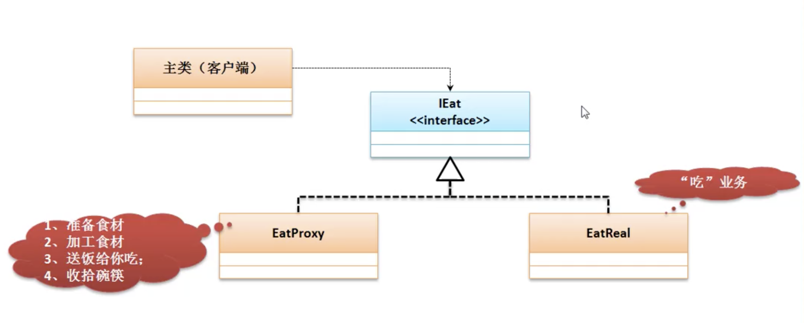

# 代理设计模式(Proxy)

* 代理设计模式的主要功能是可以帮助用户将所有的开发注意力只集中在核心业务功能的处理上



```java
interface IEat{
    public void get();
}
class EatReal implements IEat{
    @Override
    public void get(){
        System.out.println("【真实主题】、吃");
    }
}

class EatProxy implements IEat{//服务代理
    private IEat eat; //吃的对象，存储代理对象

    public EatProxy(IEat eat){ //设置代理对象
        this.eat = eat;
    }

    @Override
    public void get(){
        this.perpare();
        this.eat.get();
        this.clear();
    }

    public void perpare(){//准备食物过程
        System.out.println("【代理主题】1、准备食材");
        System.out.println("【代理主题】2、处理食材");
    }

    public void clear(){
        System.out.println("【代理主题】3、清理碗筷");
    }
}


public class JavaDemo11{
    public static void main(String [] args){
        IEat eat = new EatReal();
        EatProxy eatProxy = new EatProxy(eat);
        eatProxy.get();
        // 【代理主题】1、准备食材
        // 【代理主题】2、处理食材
        // 【真实主题】、吃
        // 【代理主题】3、清理碗筷
    }
}

```

* 代理设计模式的主要特点是:
    * 一个接口提供有两个子类，其中一个子类是真实业务操作类。另外一个是代理操作类，没有代理操作类，真实业务类无法进行。
