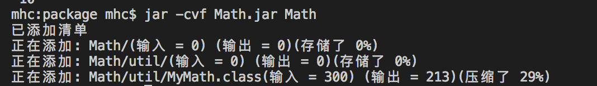

# 包

* 同一个目录中不允许存放相同的程序类文件,但是很难保证类不重复。不同目录中可以有同名文件，这个目录就叫做包。(本质就是目录)

```java
package word.hello ;//定义包.点表示分割子目录(子包)


```

* 程序开发中有包，就要把class文件保存在指定目录中,此时最好的方法就是打包操作
    * javac -d . Hello.java
        * -d : 要生成目录
        * . : 在当前所在的目录中生成程序类文件

            

    * 执行命令 java word.hello.Hello

        

* 完整的类名称为: 包.类名 

## 包的导入

* 将不同类放在不同包中后，需要调用其他包的类时，需要导入包。
    * import : 导入包关键字
    * javac -d . *.java : 表示java自己匹配打包

    ```java
        package word.hello;

        public class Hello {
            public static void main(String[] args) {
                System.out.println("hello word");
            }

            public String getHello() {
                return "Hello Word";
            }
        }
    ```

    ```java
        package word.test;//设置包名

        import word.hello.Hello; //导入其他包的类

        public class TestHello {
            public static void main(String[] args) {
                Hello h = new Hello();
                System.out.println(h.getHello());
            }
        }
    ```
    

* public class 与 class 区别
    * 实际开发中一般一个*.java文件中只有一个程序类，public class
    * public class : 
        * 类名称必须与文件名称保持一致。
        * 一个*.java文件中只允许有一个 public class。
        * 如果一个类要被其他包使用，必须使用public class。
    * class :
        * 类名称可以与文件名称不一致
        * 一个*.java文件中可以有多个 class。
        * class 本包可以访问，外包无法访问

|区别|public class | class|
|---|-------------|------|
|名称|类名称必须与文件名称保持一致。|类名称可以与文件名称不一致|
|个数|一个*.java文件中只允许有一个 public class。|一个*.java文件中可以有多个 class。|
|访问权限|可以被本包和其他包访问|本包可以访问，外包无法访问|

* 如果要使用包中的多个类,可以使用通配符 * 导入。
    * import word.hello.*; //按需加载程序类

```java
package word.test;

import word.hello.*; //通配符导入

public class TestHello {
    public static void main(String[] args) {
        Hello h = new Hello();
        System.out.println(h.getHello());
    }
}
```

*  使用* 导入包时，导入同名类。

    * word.hello.Hello 和 util.demo.Hello

```java
package word.test;//设置包名

import word.hello.*; //导入其他包的类 含有 Hello类
import util.demo.*; //导入其他包的类 含有 Hello类

public class TestHello {
    public static void main(String[] args) {
        Hello h = new Hello();
        System.out.println(h.getHello());
    }
}
```

* 编译时会报错，不明确的引用
    * 修改使用类 为明确使用 Hello h = new word.hello.Hello(); 使用类完整名称

## 静态导入

    * 如果有一个类，类中全是static方法,通过“包.类”导入，然后通过类名称调用静态方法。

    ```java
        package Math.util;

        public class MyMath {
            public static int add(int x, int y) {
                return x + y;
            }

            public static int sub(int x, int y) {
                return x - y;
            }
        }
    ```

*  从jdk1.5开始对于全是由静态方法提供的特殊类,可以采用静态导入处理。

```java
package word.test;

import static Math.util.MyMath.*; //静态导入导入其他包的类

public class TestMyMath {
    public static void main(String[] args) {
        System.out.println(add(10,20));
        System.out.println(sub(10,20));
    }
}
```

## 生成jar文件

* 项目开发完成后大量的*.class 文件，可以利用一种压缩结构处理，这种结构在java中就被成为jar文件。可以利用jdk中提供的jar命令。

    * jar --help 查看所有命令

* 生成jar文件
    * 对程序进行打包: javac -d . *.java 
    * 对打包后程序生成jar文件: jar -cvf Math.jar Math
        * -c : 创建一个新的jar文件
        * -v : 得到一个详细输出
        * -f : 设置要成才的jar文件名称，栗子中是Math.jar



* 每一个jar文件都是一个独立的程序路径。如果要想在java程序中使用，则必须通过CLASSPATH程序路径进行配置
    * 终端输入 : SET CLASSPATH = ,;Math.jar路径
    * 编译程序类: javac -d . *.java
    * 解释程序类: java word.test.TestMyMath

## 系统常见包

* java发展至今一直提供有大量的类库，一般有两种类库
    * java自身提供的(除了jdk提供的类库之外还有一些标准)
    * 由第三方厂商提供的类库

* jdk提供的类库都是封装在不同包之中
    * java.lang : String、Number、Object等类，这个包在jdk1.1之后自动默认导入
    * java.lang.reflect: 反射机制处理包，所有的设计从此开始
    * java.util : 工具类的定义，包括数据结构的定义
    * java.io : 输入输出流操作的程序包
    * java.net : 网络程序包
    * java.sql : 进行数据库编程的包
    * java.applet : java最原始的实用形式，直接嵌套在网页执行的程序类
    * java.awt、javax.swing: java的图形界面开发包(GUI),awt是重量级的组件，swing是轻量级的组件

## 访问控制权限

* 面向对象的三大主要特点: 封装、继承、多态
    * 封装 : 访问控制权限
    * 继承 : 接口、抽象类
    * 多态 : 参数的统一

* 访问控制权限分为4种: public、default、protected、private

|NO.|访问范围|private|default| protected|public|
|--|-------|--------|-------|----------|------|
|1|同一包中的同一类|Y|Y|Y|Y|
|2|同一包中的不同类|N|Y|Y|Y|
|3|不同包的子类|N|N|Y|Y|
|4|不同包的所有类|N|N|N|Y|

* protected访问权限
    * 栗子：
        * word.hello.a.Hello类 ->提供protected 属性sayHello
        * word.hello.b.Word类 -> words继承Hello 访问sayHello
            * 成功访问
        * word.hello.Word类 -> 直接访问Hello.sayHello
            * 编译失败

