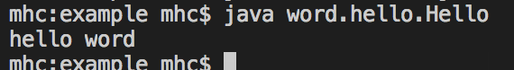
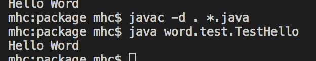

# 包

* 同一个目录中不允许存放相同的程序类文件,但是很难保证类不重复。不同目录中可以有同名文件，这个目录就叫做包。(本质就是目录)

```java
package word.hello ;//定义包.点表示分割子目录(子包)


```

* 程序开发中有包，就要把class文件保存在指定目录中,此时最好的方法就是打包操作
    * javac -d . Hello.java
        * -d : 要生成目录
        * . : 在当前所在的目录中生成程序类文件

            

    * 执行命令 java word.hello.Hello

        

* 完整的类名称为： 包.类名 

## 包的导入

* 将不同类放在不同包中后，需要调用其他包的类时，需要导入包。
    * import : 导入包关键字
    * javac -d . *.java : 表示java自己匹配打包

    ```java
        package word.hello;

        public class Hello {
            public static void main(String[] args) {
                System.out.println("hello word");
            }

            public String getHello() {
                return "Hello Word";
            }
        }
    ```

    ```java
        package word.test;//设置包名

        import word.hello.Hello; //导入其他包的类

        public class TestHello {
            public static void main(String[] args) {
                Hello h = new Hello();
                System.out.println(h.getHello());
            }
        }
    ```
    

* public class 与 class 区别
    * 实际开发中一般一个*.java文件中只有一个程序类，public class
    * public class : 
        * 类名称必须与文件名称保持一致。
        * 一个*.java文件中只允许有一个 public class。
        * 如果一个类要被其他包使用，必须使用public class。
    * class :
        * 类名称可以与文件名称不一致
        * 一个*.java文件中可以有多个 class。
        * class 本包可以访问，外包无法访问

|区别|public class | class|
|---|-------------|------|
|名称|类名称必须与文件名称保持一致。|类名称可以与文件名称不一致|
|个数|一个*.java文件中只允许有一个 public class。|一个*.java文件中可以有多个 class。|
|访问权限|可以被本包和其他包访问|本包可以访问，外包无法访问|

* 如果要使用包中的多个类,可以使用通配符 * 导入。
    * import word.hello.*; //按需加载程序类

```java
package word.test;

import word.hello.*; //通配符导入

public class TestHello {
    public static void main(String[] args) {
        Hello h = new Hello();
        System.out.println(h.getHello());
    }
}
```

*  使用* 导入包时，导入同名类。

    * word.hello.Hello 和 util.demo.Hello

```java
package word.test;//设置包名

import word.hello.*; //导入其他包的类 含有 Hello类
import util.demo.*; //导入其他包的类 含有 Hello类

public class TestHello {
    public static void main(String[] args) {
        Hello h = new Hello();
        System.out.println(h.getHello());
    }
}
```

* 编译时会报错，不明确的引用
    * 修改使用类 为明确使用 Hello h = new word.hello.Hello(); 使用类完整名称