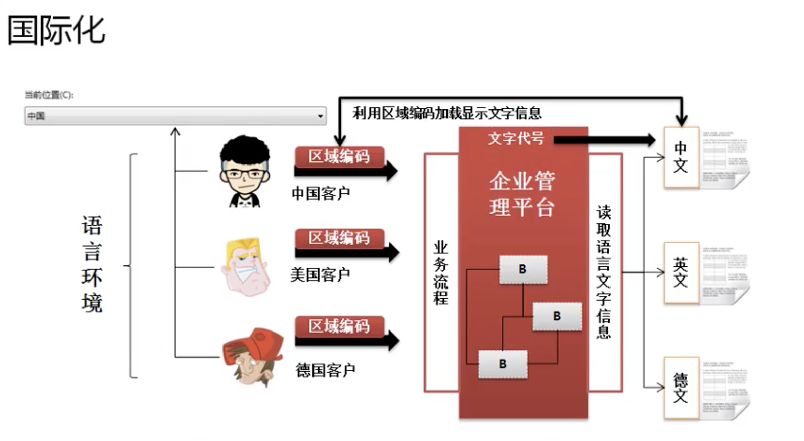
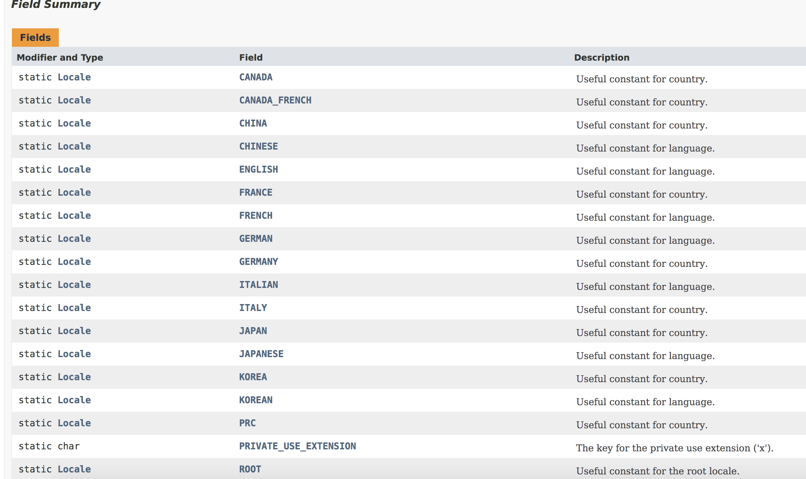

# 第11 章 ： 国际化程序实现

## 第11章 » 课时42 国际化程序实现原理



* 实现国际化的开发要解决一下两点

    * 如何定义保存文字的文件信息
    * 如何根据不同区域语言的编码读取指定的语言信息

## 第11章 » 课时43 Locale类

* 如果要想国际化，首先要解决的是不同国家区域的语言编码问题。在java.util包中提供有一个专门描述区域和语言编码的类。Locale

    * public final class Locale extends Object implements Cloneable, Serializable

        * Locale(String language)
        * Locale(String language, String country)
        * Locale(String language, String country, String variant)

* 构造函数
    * Locale​(String language)
    * Locale​(String language, String country)
        * 语言和国家代码 ： 中国：zh_CN ,美国： en_US,对于这些区域和语言的编码获取百度一下。

```java
import java.util.Locale;

public class JavaDemo52 {
    public static void main(String[] args) {
        Locale l = new Locale("zh","CN");//中文环境
        System.out.println(l.getLanguage());
    }
}
```

* 自动获得当前的运行环境。那么就可以使用Locale类默认的环境进行实例化。

    * 读取本地默认环境： public static Locale getDefault​()

```java
import java.util.Locale;

public class JavaDemo52 {
    public static void main(String[] args) {
        Locale l = Locale.getDefault();//获取默认环境
        System.out.println(l.getLanguage());//zh
    }
}
```

* Locale中的常量



```java
import java.util.Locale;

public class JavaDemo52 {
    public static void main(String[] args) {
        Locale l = Locale.CHINA;//获取常量环境
        System.out.println(l.getLanguage());//zh
        Locale l1 = Locale.ENGLISH;//获取常量环境
        System.out.println(l1.getLanguage());//en
    }
}
```

## 第11章 » 课时44 ResourceBundle读取资源文件

* 使用java.util.ResourceBundle类读取资源文件。

* public abstract class ResourceBundle extends Object

    * 是一个抽象类，ResourceBundle类对象实例化，可以使用该类中的一个静态方法
        * 获取ResourceBundle类对象 ： public static final ResourceBundle getBundle​(String baseName)
            * baseName 描述的是资源文件的名称，但是没有后缀。
        * 从实例中读取信息： public final String getString​(String key)

<strong>

* .properties文件 可以在读的时候不加入文件后缀
* 如果资源没有在包里，直接编写资源名称即可

```java
import java.util.Locale;
import java.util.ResourceBundle;

public class JavaDemo52 {
    public static void main(String[] args) {
        //.properties文件 可以在读的时候不加入文件后缀
        // 若果资源没有在包里，直接编写资源名称即可
        ResourceBundle rb = ResourceBundle.getBundle("language");
        String info = rb.getString("info");
        System.out.println(info);
        // 这是从.propserites文件中读取的信息;
    }
}
```

* 在进行资源读取时候 
    * 找不到资源： Exception in thread "main" java.util.MissingResourceException: Can't find bundle for base name 11language, locale zh_CN_#Hans
    * 找到资源未找到key：Exception in thread "main" java.util.MissingResourceException: Can't find resource for bundle java.util.PropertyResourceBundle, key infos

</strong>

## 第11章 » 课时45 实现国际化程序开发

* 国际化实现，核心为读取资源信息

```java
import java.util.Locale;
import java.util.ResourceBundle;

public class JavaDemo52 {
    public static void main(String[] args) {
        Locale l = Locale.getDefault();
        System.out.println(l);
        String lan;
        if (l.getLanguage().matches("[zh].*")) {
            lan = "_zh_CN";
        } else {
            lan = "_en_US";
        }
        // .properties文件 可以在读的时候不加入文件后缀
        // 若果资源没有在包里，直接编写资源名称即可
        ResourceBundle rb = ResourceBundle.getBundle("package/word/language/message" + lan);
        String info = rb.getString("info");
        System.out.println(info);
    }
}
```

<strong>

* ResourceBundle重载设置Locale对象
    * public static final ResourceBundle getBundle​(String baseName, Locale locale)
    * 该方法 Locale 如果不传，会读取本地默认语言配置 ，Locale.getDefault()方法返回的语言，如果Locale传递的语言没有设置对应的配置文件，则读取默认配置

</strong>

```java
import java.util.Locale;
import java.util.ResourceBundle;

public class JavaDemo52 {
    public static void main(String[] args) {
        // .properties文件 可以在读的时候不加入文件后缀
        // 若果资源没有在包里，直接编写资源名称即可
        // 默认使用当前系统默认文件 读取 message_zh_CN
        ResourceBundle rb = ResourceBundle.getBundle("package/word/language/message");
        String info = rb.getString("info");
        System.out.println(info);
        // zh_CN中文;
    }
}

```

```java
import java.util.Locale;
import java.util.ResourceBundle;

public class JavaDemo52 {
    public static void main(String[] args) {
        Locale l = Locale.US;
        // .properties文件 可以在读的时候不加入文件后缀
        // 若果资源没有在包里，直接编写资源名称即可
        ResourceBundle rb = ResourceBundle.getBundle("package/word/language/message",l);
        String info = rb.getString("info");
        System.out.println(info);
        // en_US英文;
    }
}
```