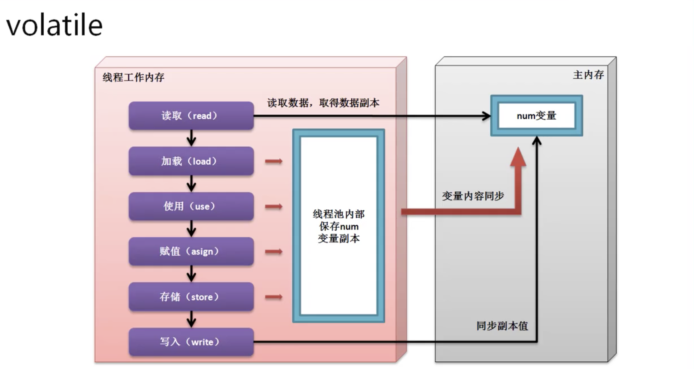

# 多线程深入

* 有部分方法jdk1.2起已经明确标注要被废除了
    * 停止多线程 ： public void stop()
    * 销毁多线程 ： public void destroy()
    * 挂起多线程 (暂停执行)： public final void suspend()
    * 恢复线程：public final void resume()

* 废除以上方法的原因是因为有可能导致线程的死锁。

* 实现线程柔和的停止

```java

public class JavaDemo41 {
    public static Boolean flag = true;

    public static void main(String[] args) throws Exception {
        new Thread(() -> {
            int num = 0;
            while (flag) {
                try {
                    Thread.sleep(50);
                } catch (InterruptedException e) {
                    e.printStackTrace();
                }
                System.out.println(Thread.currentThread().getName() + "、num=" + num++);
            }
        }).start();
        Thread.sleep(200);
        flag = false;
        // Thread-0、num=0
        // Thread-0、num=1
        // Thread-0、num=2
        // Thread-0、num=3
    }
}
```

## 后台守护线程

* 如果现在主线程的程序或者其他线程的程序还在执行的时候，那么守护线程将一直存在，并且运行在后台状态。

* Thread类中守护线程的操作方法：
    * 设置守护线程： public final void setDaemon​(boolean on)
        * on - if true, marks this thread as a daemon thread

    * 判断是否为守护线程 ： public final boolean isDaemon​()
        * true if this thread is a daemon thread; false otherwise.

* 使用守护线程

```java

public class JavaDemo41 {
    public static void main(String[] args) throws Exception {
        Thread userThread = new Thread(() -> {
            for (int i = 0; i < 5; i++) {
                try {
                    Thread.sleep(50);
                } catch (InterruptedException e) {
                    e.printStackTrace();
                }
                System.out.println(Thread.currentThread().getName() + "、i= " + i);
            }
        }, "用户线程");
        Thread daemonThread = new Thread(() -> {
            // 设置循环次数为 int 最大值
            for (int i = 0; i < Integer.MAX_VALUE; i++) {
                try {
                    Thread.sleep(50);
                } catch (InterruptedException e) {
                    e.printStackTrace();
                }
                System.out.println(Thread.currentThread().getName() + "、i= " + i);
            }
        }, "守护线程");
        daemonThread.setDaemon(true);// 设置守护线程
        userThread.start();
        daemonThread.start();
        //守护线程不会执行到 int最大值才结束，而是被守护线程结束后，守护线程也结束
        // 守护线程、i= 0
        // 用户线程、i= 0
        // 用户线程、i= 1
        // 守护线程、i= 1
        // 守护线程、i= 2
        // 用户线程、i= 2
        // 守护线程、i= 3
        // 用户线程、i= 3
        // 守护线程、i= 4
        // 用户线程、i= 4
    }
}
```

* 如果用户线程执行完毕，守护线程也就消失了，JVM中最大的守护线程就是GC线程。

## volatile关键字

* 在多线性定义之中，volatile关键字主要是在属性定义上使用，表示此属性为直接数据操作，而不进行副本的拷贝处理。（原子操作）
    * 在正常进行变量处理的时候
        * 获取变量原有的数据内容副本。
        * 使用副本内容进行计算
        * 将计算后的变量保存到原始空间之中。
    * 如果一个数据追加了volatile关键字之后，表示不使用副本，直接操作原始变量，相当于节约了拷贝副本，重新保存的步骤。

    


* volatile与 synchronized的区别

    * volatile主要定义在属性上，synchronized主要定义在方法或程序块上。

    * volatile是直接操作属性原始内存的处理，避免了副本的操作
    * synchronized是实现同步的。