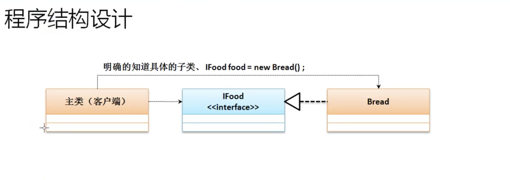
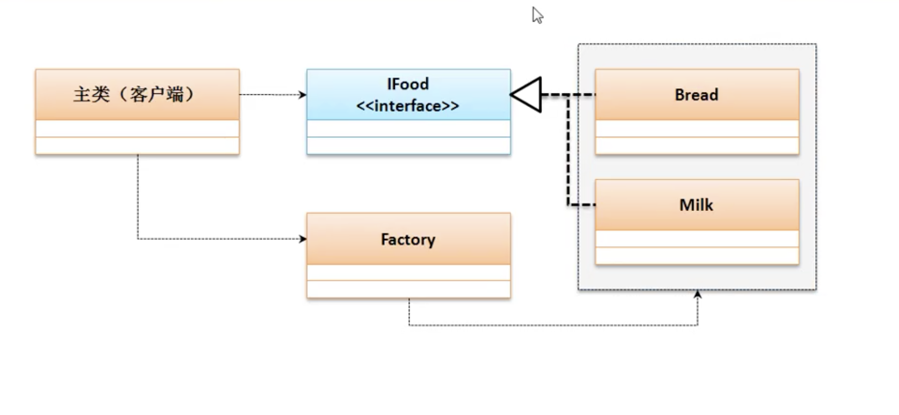

# 工厂设计模式(Factory)

* 接口必须有子类，并且子类对象的向上转型来获取接口的实例化对象。但是在进行对象实例化的过程之中也可能存在设计问题。

```java
    interface IFood {
        public void eat();
    }

    class Bread implements IFood{
        @Override
        public void eat(){
            System.out.println("吃面包");
        }
    }

    class Milk implements IFood{
        @Override
        public void eat(){
            System.out.println("喝牛奶");
        }
    }

    public class JavaDemo10{
        public static void main(String args []){
            IFood bread = new Bread();
            bread.eat();
            // 吃面包
        }
    }
```



* 客户端需要知道具体的哪一个子类,如果需要牛奶了，客户端就需要修改
* 扩展一类食物，上例中要想喝牛奶就要修改客户端，new Milk(),现在程序出现耦合问题，关键字new造成耦合

```java
interface IFood {
    public void eat();
}

class Bread implements IFood {
    @Override
    public void eat() {
        System.out.println("吃面包");
    }
}

class Milk implements IFood {
    @Override
    public void eat() {
        System.out.println("喝牛奶");
    }
}

class Factory {
    public static IFood getInstance(String className) {
        switch (className) {
        case "bread":
            return new Bread();
        case "milk":
            return new Milk();
        default:
            return null;
        }
    }
}

public class JavaDemo10 {
    public static void main(String args[]) {
        IFood food = Factory.getInstance(args[0]);
        food.eat();
        // java JavaDemo10 milk
        // 喝牛奶
        // java JavaDemo10 bread
        // 吃面包
    }
}

```

* 客户端程序类与IFood接口没有任何关联，所有的关联都是通过Factory类完成的,在程序运行的时候所有参数都是通过初试化参数完成
    * java JavaDemo10 milk
    * java JavaDemo10 bread

