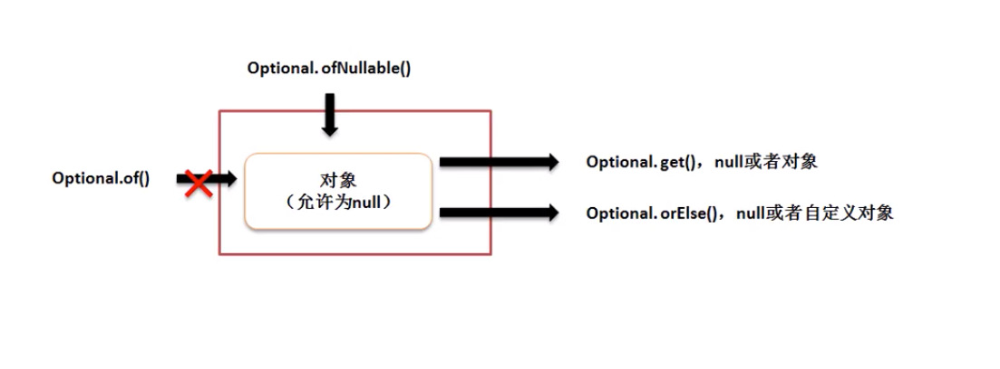

# 开发支持类库

## 第12章 » 课时47 UUID类

* UUID是一种生成无重复的字符串类，这种程序类的主要目的是根据时间戳自动的实现无重复字符串。(本质是有很低几率出现重复的，概率千万亿分之一。)

```java
Module java.base
Package java.util
Class UUID
```

* 一般获取UUID都是随机生成的模式，所有可以使用如下功能实现：
    * 获取UUID对象： public static UUID randomUUID​()
    * 从字符串回到UUID： public static UUID fromString​(String name)

* 什么时候使用UUID，一般对文件自动命名时使用UUID

```java
import java.util.UUID;
public class JavaDemo53{
    public static void main(String[] args) {
        //获取UUID对象
        UUID uid = UUID.randomUUID();
        //输出UUID对象，默认调用toString输出字符串
        System.out.println(uid);
        //15f85631-b64f-4712-9e7e-e1e2e5b267d2
    }
}
```

## 第12章 » 课时48 Optional类

```java
Module java.base
Package java.util
Class Optional<T>
```

* Optional类主要是进行null的相关处理。在以前程序开发之中为防止程序出现空指向异常，一般是追加null的验证。

* 预防null，一般自引用接收方被动进行判断，为了解决这种被动的操作，java类中提供有一个Optional类，这个类可以实现空的处理操作。在这个类里提供有如下操作方法
    * 返回空数据：public static <T> Optional<T> empty​()
    * 获取数据： public T get​()
    * 保存数据但是不允许出现null : public static <T> Optional<T> of​(T value)
        * 保存数据出现空，则抛出NullPointerException 
    * 保存数据但是允许出现null :public static <T> Optional<T> ofNullable​(T value)

    * 空的时候返回其他数据： public T orElse​(T other)



* 🌰修改程序按照正规完成

```java
import java.util.Optional;

interface IMessage{
    public String getConnect();
}

class MessageImpl implements IMessage{
    @Override
    public String getConnect() {
        return "链接成功";
    }
}

class MessageUtil{
    private MessageUtil(){};
    //通过Optional包装对象进行对其验证
    public static  Optional<IMessage> getMessage(){
        return Optional.of(new MessageImpl());
    }
    public static void UseMessage(IMessage msg){
        // //预防null 自引用接收方被动进行判断
        // if(msg != null){
        //     System.out.println(msg.getConnect());
        // }

        // 使用Optional
        System.out.println(msg.getConnect());
    }
}

public class JavaDemo53{
    public static void main(String[] args) {
        //使用null会空指向异常 NullPointerException
        MessageUtil.UseMessage(MessageUtil.getMessage().get());//链接成功
    }
}
```

* 如果保存数据为null，就会在保存出出现异常。

```java
public static  Optional<IMessage> getMessage(){
    return Optional.of(null);
}
// Exception in thread "main" java.lang.NullPointerException
// 	at java.base/java.util.Objects.requireNonNull(Objects.java:221)
// 	at java.base/java.util.Optional.<init>(Optional.java:107)
// 	at java.base/java.util.Optional.of(Optional.java:120)
// 	at MessageUtil.getMessage(JavaDemo53.java:20)
// 	at JavaDemo53.main(JavaDemo53.java:42)
```

* 如果使用Optional.ofNullable且使用get获取数据就会出现以下错误，需要更换get为orElse方法，相当于为当值为null，设置T（泛型）类型默认值

```java
public static  Optional<IMessage> getMessage(){
    return Optional.ofNullable(null);
}
// Exception in thread "main" java.util.NoSuchElementException: No value present
// 	at java.base/java.util.Optional.get(Optional.java:148)
// 	at JavaDemo53.main(JavaDemo53.java:42)

```

```java
// 相当于为当值为null，设置T类型默认值
MessageUtil.UseMessage(MessageUtil.getMessage().orElse(new MessageImpl())); //链接成功

```

* 在所有引用操作处理中null是一个重要的技术问题，所以jdk1.8之后这个新的类对于null的处理很有帮助。