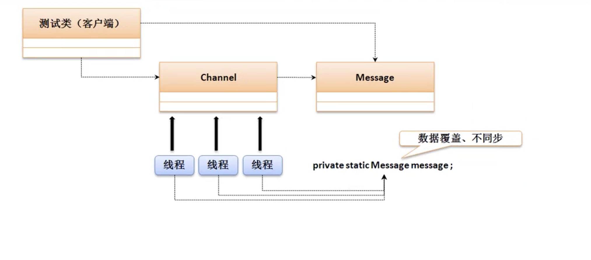
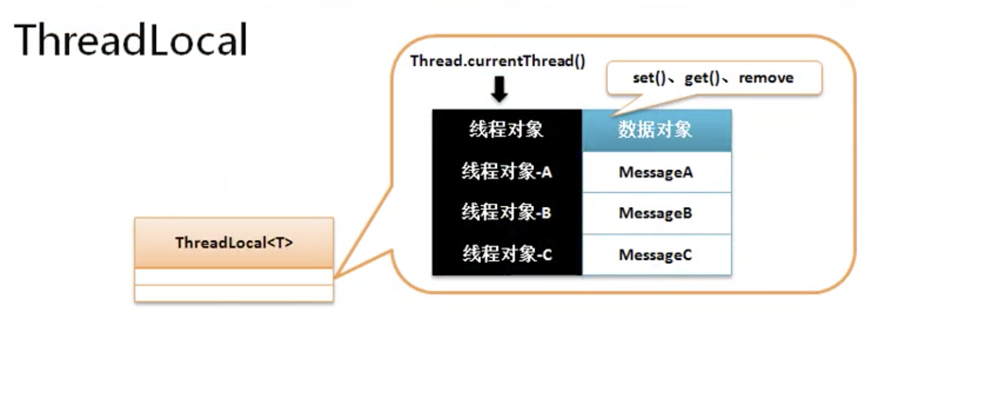
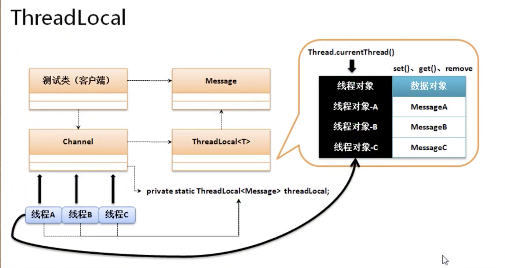
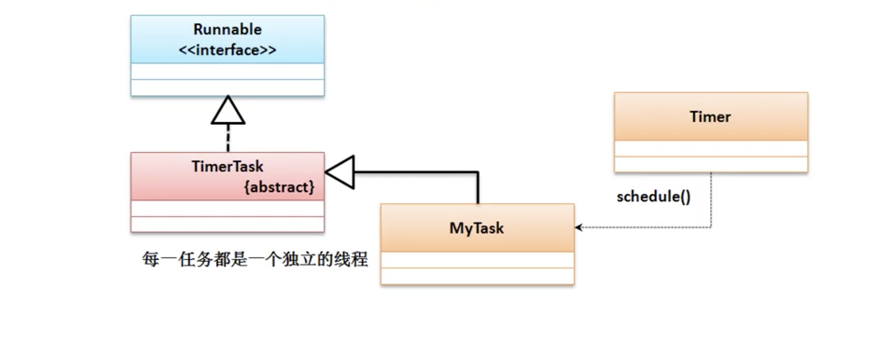

# 开发支持类库

## 第12章 » 课时47 UUID类

* UUID是一种生成无重复的字符串类，这种程序类的主要目的是根据时间戳自动的实现无重复字符串。(本质是有很低几率出现重复的，概率千万亿分之一。)

```java
Module java.base
Package java.util
Class UUID
```

* 一般获取UUID都是随机生成的模式，所有可以使用如下功能实现：
    * 获取UUID对象： public static UUID randomUUID​()
    * 从字符串回到UUID： public static UUID fromString​(String name)

* 什么时候使用UUID，一般对文件自动命名时使用UUID

```java
import java.util.UUID;
public class JavaDemo53{
    public static void main(String[] args) {
        //获取UUID对象
        UUID uid = UUID.randomUUID();
        //输出UUID对象，默认调用toString输出字符串
        System.out.println(uid);
        //15f85631-b64f-4712-9e7e-e1e2e5b267d2
    }
}
```

## 第12章 » 课时48 Optional类

```java
Module java.base
Package java.util
Class Optional<T>
```

* Optional类主要是进行null的相关处理。在以前程序开发之中为防止程序出现空指向异常，一般是追加null的验证。

* 预防null，一般自引用接收方被动进行判断，为了解决这种被动的操作，java类中提供有一个Optional类，这个类可以实现空的处理操作。在这个类里提供有如下操作方法
    * 返回空数据：public static <T> Optional<T> empty​()
    * 获取数据： public T get​()
    * 保存数据但是不允许出现null : public static <T> Optional<T> of​(T value)
        * 保存数据出现空，则抛出NullPointerException 
    * 保存数据但是允许出现null :public static <T> Optional<T> ofNullable​(T value)

    * 空的时候返回其他数据： public T orElse​(T other)


* 🌰修改程序按照正规完成

```java
import java.util.Optional;

interface IMessage{
    public String getConnect();
}

class MessageImpl implements IMessage{
    @Override
    public String getConnect() {
        return "链接成功";
    }
}

class MessageUtil{
    private MessageUtil(){};
    //通过Optional包装对象进行对其验证
    public static  Optional<IMessage> getMessage(){
        return Optional.of(new MessageImpl());
    }
    public static void UseMessage(IMessage msg){
        // //预防null 自引用接收方被动进行判断
        // if(msg != null){
        //     System.out.println(msg.getConnect());
        // }

        // 使用Optional
        System.out.println(msg.getConnect());
    }
}

public class JavaDemo53{
    public static void main(String[] args) {
        //使用null会空指向异常 NullPointerException
        MessageUtil.UseMessage(MessageUtil.getMessage().get());//链接成功
    }
}
```

* 如果保存数据为null，就会在保存出出现异常。

```java
public static  Optional<IMessage> getMessage(){
    return Optional.of(null);
}
// Exception in thread "main" java.lang.NullPointerException
// 	at java.base/java.util.Objects.requireNonNull(Objects.java:221)
// 	at java.base/java.util.Optional.<init>(Optional.java:107)
// 	at java.base/java.util.Optional.of(Optional.java:120)
// 	at MessageUtil.getMessage(JavaDemo53.java:20)
// 	at JavaDemo53.main(JavaDemo53.java:42)
```

* 如果使用Optional.ofNullable且使用get获取数据就会出现以下错误，需要更换get为orElse方法，相当于为当值为null，设置T（泛型）类型默认值

```java
public static  Optional<IMessage> getMessage(){
    return Optional.ofNullable(null);
}
// Exception in thread "main" java.util.NoSuchElementException: No value present
// 	at java.base/java.util.Optional.get(Optional.java:148)
// 	at JavaDemo53.main(JavaDemo53.java:42)

```

```java
// 相当于为当值为null，设置T类型默认值
MessageUtil.UseMessage(MessageUtil.getMessage().orElse(new MessageImpl())); //链接成功

```

* 在所有引用操作处理中null是一个重要的技术问题，所以jdk1.8之后这个新的类对于null的处理很有帮助。

## 第12章 » 课时49 ThreadLocal类

* 以下程序是单线程模式处理，如果在多线性状态下能否实现同样效果。

```java

class Channel {
    private static Message message;

    private Channel(){}

    public static void setMessage(Message m) {
        message = m;
    }

    public static void send() {
        System.out.println(message.getInfo());
    }
}

class Message {
    private String info;

    /**
     * @param message the message to set
     */
    public void setInfo(String message) {
        this.info = message;
    }

    /**
     * @return the message
     */
    public String getInfo() {
        return info;
    }
}

public class JavaDemo54 {
    public static void main(String[] args) {
        Message msg = new Message();
        msg.setInfo("message");
        Channel.setMessage(msg);
        Channel.send();//message
    }
}

```

* 多线程下消息之间产生影响

```java

class Channel {
    private static Message message;

    private Channel() {
    }

    public static void setMessage(Message m) {
        message = m;
    }

    public static void send() {
        System.out.println(Thread.currentThread().getName() + "-" + message.getInfo());
    }
}

class Message {
    private String info;

    /**
     * @param message the message to set
     */
    public void setInfo(String message) {
        this.info = message;
    }

    /**
     * @return the message
     */
    public String getInfo() {
        return info;
    }
}

public class JavaDemo54 {
    public static void main(String[] args) {
        new Thread(() -> {
            Message msg = new Message();
            msg.setInfo("message1");
            Channel.setMessage(msg);
            Channel.send();// message
        }, "线程A").start();
        new Thread(() -> {
            Message msg = new Message();
            msg.setInfo("message2");
            Channel.setMessage(msg);
            Channel.send();// message
        }, "线程B").start();
        new Thread(() -> {
            Message msg = new Message();
            msg.setInfo("message3");
            Channel.setMessage(msg);
            Channel.send();// message
        }, "线程C").start();
        // 线程B-message2
        // 线程A-message2
        // 线程C-message3
    }
}
```



* 在保持Channel核心结构不变的情况,需要考虑到每个线程的独立操作，
再这样的情况下对于Channel类而言除了要保留消息之外，还应该多存放每一个线程的标记(当前线程)。那么这时候就可以通过ThreadLocal类存放数据。

```java
Module java.base
Package java.lang
Class ThreadLocal<T>
```

* 提供如下方法

    * 构造方法：public ThreadLocal​() 创建新的ThreadLocal方法
    * 设置数据： public void set​(T value)
    * 获取数据： public T get​()
    * 删除数据： public void remove​()






* 解决线程同步问题，每一个线程通过ThreadLocal只能保存一个数据

```java

class Channel {
    private static final ThreadLocal<Message> THREADLOCAL = new ThreadLocal<>();

    private Channel() {
    }

    public static void setMessage(Message m) {
        THREADLOCAL.set(m);;
    }

    public static void send() {
        System.out.println(Thread.currentThread().getName() + "-" + THREADLOCAL.get().getInfo());
    }
}

class Message {
    private String info;

    /**
     * @param message the message to set
     */
    public void setInfo(String message) {
        this.info = message;
    }

    /**
     * @return the message
     */
    public String getInfo() {
        return info;
    }
}

public class JavaDemo54 {
    public static void main(String[] args) {
        new Thread(() -> {
            Message msg = new Message();
            msg.setInfo("message1");
            Channel.setMessage(msg);
            Channel.send();// message
        }, "线程A").start();
        new Thread(() -> {
            Message msg = new Message();
            msg.setInfo("message2");
            Channel.setMessage(msg);
            Channel.send();// message
        }, "线程B").start();
        new Thread(() -> {
            Message msg = new Message();
            msg.setInfo("message3");
            Channel.setMessage(msg);
            Channel.send();// message
        }, "线程C").start();
        // 线程B-message2
        // 线程A-message2
        // 线程C-message3
    }
}
```

## 第12章 » 课时50 定时调度

* 定时器

    *  定时器的主要操作是定时任务，在java中提供有定时任务打的支持，这种任务只是实现了间隔触发的操作。
    * 如果要实现定时操作，主要有一个定时操作的主体类，以及一个定时任务的控制。

* 有两个程序类

    * java.util.TimerTask类： 实现定时任务处理
    * java.util.Timer类：进行任务的启动，启动的方法：
        * 任务启动： public void schedule​(TimerTask task, long delay) 单位为毫秒
        * public void schedule​(TimerTask task, Date time)
        * 间隔触发： public void scheduleAtFixedRate​(TimerTask task, long delay, long period)

```java
Module java.base
Package java.util
Class Timer

public class Timer extends Object

/****************/
Module java.base
Package java.util
Class TimerTask

public abstract class TimerTask extends Object implements Runnable
```



```java
import java.util.Timer;
import java.util.TimerTask;

class MyTimerTask extends TimerTask {
    @Override
    public void run() {
        System.out.println(Thread.currentThread().getName());
    }
}

public class JavaDemo55 {
    public static void main(String[] args) {
        Timer t = new Timer();
        TimerTask ts = new MyTimerTask();
        t.scheduleAtFixedRate(ts, 500, 500);
    }
}
```


* jdk提供的最原始的支持，实际上开发之中利用此类方式进行的定时处理会非常复杂。

## 第12章 » 课时51 Base64加密与解密

* jdk1.8开始提供有一组新的加密处理操作类。Base64处理类

    * Base64.Encoder :进行加密处理
        * 加密处理： public int encode​(byte[] src)
    * Base64.Decoder :进行解密处理
        * 解密处理： public byte[] decode​(String src)
```java
Module java.base
Package java.util
Class Base64
```

```java
import java.util.*;

public class JavaDemo55 {
    public static void main(String[] args) {
        String str = "测试信息";
        byte[] b = Base64.getEncoder().encode(str.getBytes());
        String bStr = new String(b);
        System.out.println(bStr);// 5rWL6K+V5L+h5oGv
        byte[] res = Base64.getDecoder().decode(bStr);
        System.out.println(new String(res));
        // 5rWL6K+V5L+h5oGv
        // 测试信息
    }
}
```

* 由于Base64是公版的算法加密，并不安全，最好是使用盐值操作。

    * 盐值操作，就是混入其他字符串,打乱正常结果

```java
public class JavaDemo55 {
    public static void main(String[] args) {
        String str1 = "abc";
        String str = "测试信息" + "{" + str1 + "}";
        byte[] b = Base64.getEncoder().encode(str.getBytes());
        String bStr = new String(b);
        System.out.println(bStr);
        byte[] res = Base64.getDecoder().decode(bStr);
        System.out.println(new String(res));
    }
}
```

* 如果是密码存储，即使现在有盐值，发现实际效果也不是很好。最好的做法是多次加密，最好的做法是使用2-3中加密算法。