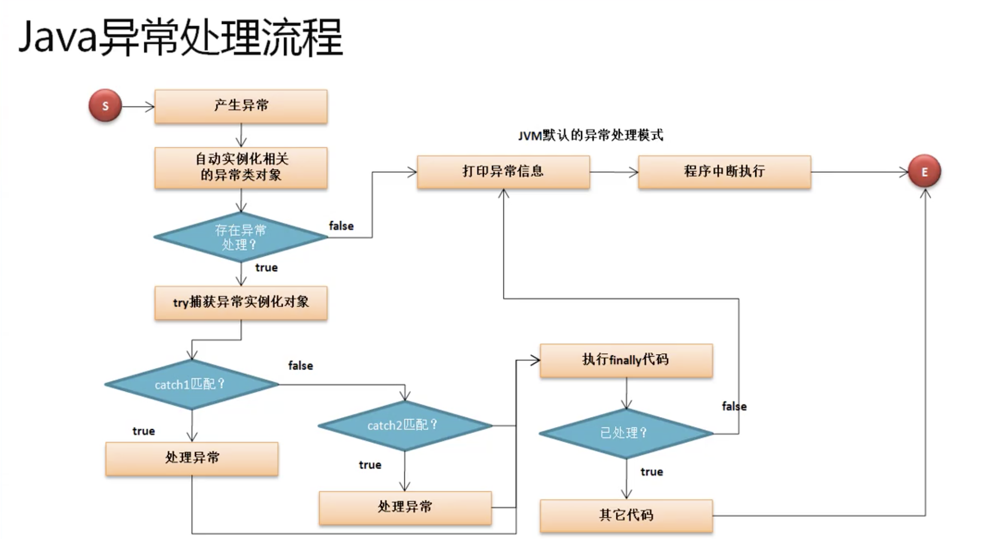

# 异常

## 异常的处理

* 导致程序中断执行的一种指令流。

* 为了保证程序出现非致命错误之后，程序依然可以正常执行完毕，所以需要一个完善的异常处理机制，以保证程序的顺利执行。

### java中异常处理

* 关键字： try、catch、finally

* 基本处理结构

```java
try{
    //可能出现异常的程序代码
}catch(){//异常类型 异常对象
    //异常处理
}catch(){

}finally{
    // 不管异常是否处理都要执行
}

```

* 常用组合： try...catch、try...catch...finally、 try...finally

* 🌰

```java
// 异常代码
public class JavaDemo18 {
    public static void main(String[] args) {
        System.out.println("【1】程序开始执行");
        System.out.println("【2】计算10/2" + (10 / 0));
        System.out.println("【3】程序执行结束");

            // 【1】程序开始执行
            // Exception in thread "main" java.lang.ArithmeticException: / by zero
            //     at JavaDemo18.main(JavaDemo18.java:4)
    }
}
```

```java
public class JavaDemo18 {
    public static void main(String[] args) {
        System.out.println("【1】程序开始执行");
        try{
            System.out.println("【2】计算10/2=" + (10 / 0));
        }catch(ArithmeticException e){
            System.out.println(e);
        }finally{
            System.out.println("是否异常都执行");
        }
        System.out.println("【3】程序执行结束");
        // 【1】程序开始执行
        // java.lang.ArithmeticException: / by zero
        // 是否异常都执行
        // 【3】程序执行结束
    }
}
```

* 获取完整异常信息
    * printStackTrace()

```java
public class JavaDemo18 {
    public static void main(String[] args) {
        System.out.println("【1】程序开始执行");
        try{
            System.out.println("【2】计算10/2=" + (10 / 0));
        }catch(ArithmeticException e){
            e.printStackTrace();//获取完成的异常信息
        }finally{
            System.out.println("是否异常都执行");
        }
        System.out.println("【3】程序执行结束");
        // 【1】程序开始执行
        // java.lang.ArithmeticException: / by zero
        // at JavaDemo18.main(JavaDemo18.java:5)
        // 是否异常都执行
        // 【3】程序执行结束
    }
}
```

### 处理多个异常

* 在程序中可能产生多个异常，可以使用多个catch进行异常的捕获。

* 即使有了异常处理，但是如果没有进行正确的异常处理，那么程序也会导致中断。(finally的代码依然执行)

### 异常处理流程

* 异常产生之后程序做了哪些处理



* 1、在程序运行中才会产生异常，一旦在程序之中产生了异常之后 自动实例化相关的异常类
* 2、如果此时程序之中没有提供异常处理的支持，则会采用jvm的默认异常处理，首先进行异常信息的打印，而后直接退出当前的程序。
* 3、 此时程序中如果存在有异常处理那么这个产生的异常类的实例化对象将会被try语句捕获
* 4、 try捕获到异常之后，与其匹配到的catch中的异常类型进行一次比对。
    * 如果此时与catch中的捕获异常类相同，则认为应该使用此catch进行异常处理
    * 如果不匹配后续还有catch语句，继续匹配后续catch类型。如果米有匹配成功，则无法进行异常处理
* 5、 不管最后有没有处理异常成功都最终都要执行finally中的语句。
    * 如果当前异常处理过了，则继续向后执行代码。
    * 如果没有处理，则交由jvm进行默认异常处理。


* 异常的处理过程实际上是处理的异常错误的实例化对象
    * Throwable
        * Error ： 此时程序还未执行出现的错误，开发者无法处理
        * Exception ： 程序中出现的异常开发者可以处理，在开发之中真正要关注的就是Exception

* 异常产生的时候，会产生异常的实例化对象，按照对象的转换原则，可以自动向父类(Exception)转型。

* 简化异常处理

```java
public class JavaDemo18 {
    public static void main(String[] args) {
        System.out.println("【1】程序开始执行");
        try {
            int x = Integer.parseInt(args[0]);
            int y = Integer.parseInt(args[1]);
            System.out.println("【2】计算x/y=" + (x / y));
        } catch (Exception e) {
            e.printStackTrace();
        } finally {
            System.out.println("是否异常都执行");
        }
        System.out.println("【3】程序执行结束");
        // 无参数 下标越界错误 java JavaDemo18
        // 【1】程序开始执行
        // java.lang.ArrayIndexOutOfBoundsException: Index 0 out of bounds for length 0
        // at JavaDemo18.main(JavaDemo18.java:5)
        // 是否异常都执行
        // 【3】程序执行结束

        // 参数类型错误 java JavaDemo18 a b 
        // 【1】程序开始执行
        // java.lang.NumberFormatException: For input string: "a"
        // at
        // java.base/java.lang.NumberFormatException.forInputString(NumberFormatException.java:65)
        // at java.base/java.lang.Integer.parseInt(Integer.java:652)
        // at java.base/java.lang.Integer.parseInt(Integer.java:770)
        // at JavaDemo18.main(JavaDemo18.java:5)
        // 是否异常都执行
        // 【3】程序执行结束

        // java JavaDemo18 10 0
        // 【1】程序开始执行
        // java.lang.ArithmeticException: / by zero
        // at JavaDemo18.main(JavaDemo18.java:5)
        // 是否异常都执行
        // 【3】程序执行结束
    }
}
```

* 同时处理多个异常时，要把捕获范围大的异常放在捕获范围小的异常处理之后。

### throws 关键字

* 在程序执行过程中告诉使用者，这个方法可能会产生何种异常。在方法声明上用throws关键字标注会产生何种异常。

* throws 抛出异常是想上一级调用抛出异常

* 🌰

```java
class MyMath {
    //这里可能会产生异常，如果产生异常调用出处理
    public static int div(int x, int y) throws Exception {
        return x / y;
    }
}

public class JavaDemo20 {
    public static void main(String[] args) {
        try{
            System.out.println(MyMath.div(10,2));
        }catch(Exception e){
            e.printStackTrace();
        }
    }
}
```

* 如果主方法向上抛出异常，则交由jvm处理

```java
class MyMath {
    //这里可能会产生异常，如果产生异常调用出处理
    public static int div(int x, int y) throws Exception {
        return x / y;
    }
}

public class JavaDemo20 {
    public static void main(String[] args) throws Exception {
            System.out.println(MyMath.div(10,2));
    }
}
```

### throw关键字

* throw的主要作用是手动抛出一个异常的实例化对象，并且进行异常的抛出处理。

```java
public class JavaDemo21 {
    public static void main(String[] args) {
        try {
            throw new Exception("手动抛出异常");
        } catch (Exception e) {
            e.printStackTrace();
        }
        // java.lang.Exception: 手动抛出异常
        // at JavaDemo21.main(JavaDemo21.java:4)
    }
}
```

|区别|throw|throws|
|---|----|----|
|1|在代码块中使用，主要是手工对异常的抛出|方法定义上使用的，表示此方法将产生的异常明确告诉给调用出,由调用出进行处理|

### 异常处理模型

* try、catch、finally、throws、throw

* 长用于在以后的资源访问。

```java

class MyMath {
    // 这里可能会产生异常，如果产生异常调用出处理
    public static int div(int x, int y) throws Exception {
        int temp = 0;
        System.out.println("计算开始");
        try{
            temp = x / y;
        }finally{
            System.out.println("计算结束");
        }
        return temp;
    }
}

public class JavaDemo20 {
    public static void main(String[] args) throws Exception {
        System.out.println(MyMath.div(10, 0));
    }
}

// 或者

class MyMath {
    // 这里可能会产生异常，如果产生异常调用出处理
    public static int div(int x, int y) throws Exception {
        int temp = 0;
        System.out.println("计算开始");
        try {
            temp = x / y;
        } catch (Exception e) {
            throw e; //向上抛出异常
        } finally {
            System.out.println("计算结束");
        }
        return temp;
    }
}

public class JavaDemo20 {
    public static void main(String[] args) throws Exception {
        System.out.println(MyMath.div(10, 0));
    }
}

```

### RuntimeException

```java
java.lang.Object
    java.lang.Throwable
        java.lang.Exception
            java.lang.RuntimeException
                java.lang.IllegalArgumentException
                    java.lang.NumberFormatException
```

* 抛出异常后不强制处理。提供一个灵活的可选的异常处理父类RuntimeException,这个类的异常子类可以不强制异常处理

* Integer.ParseInt()方法: public static int parseInt​(CharSequence s,int beginIndex,int endIndex,int radix) throws NumberFormatException

    * 这个方法明确的抛出了一个异常，但是在处理的时候并没有强制性要求处理。

|区别|Exception|RunTimeException|
|---|---|---|
|1|Exception必须强制进行处理|是Exception的子类，可以不强制处理异常|

### 自定义异常类

* 实现方案
    * 继承 Exception、RunTimeException

```java

class BombException extends Exception {
    public BombException(String msg) {
        super(msg);
    }
}

class Food {
    public static void eat(int num) throws BombException {
        if (num > 10) {
            throw new BombException("吃多了");
        }
        {
            System.out.println("正常");
        }
    }
}

public class JavaDemo22 {
    public static void main(String[] args) throws Exception {
        Food.eat(11);
        // Exception in thread "main" BombException: 吃多了
        // at Food.eat(JavaDemo22.java:11)
        // at JavaDemo22.main(JavaDemo22.java:21)
    }
}
```

### assert断言

* 从jdk1.4增加断言功能

```java
public class JavaDemo23 {
    public static void main(String[] args) {
        int x = 10;
        assert x == 100 : "x的内容不是100";
        System.out.println(x);
        //10
    }
}
```

* 要想执行断言，则必须在程序执行的时候加入参数 java -ea JavaDemo23

```java
mhc:example mhc$ java -ea  JavaDemo23
Exception in thread "main" java.lang.AssertionError: x的内容不是100
        at JavaDemo23.main(JavaDemo23.java:4)
```

* 在java里并没有将断言设置为必须执行的步骤，需要在特定环境下才执行
