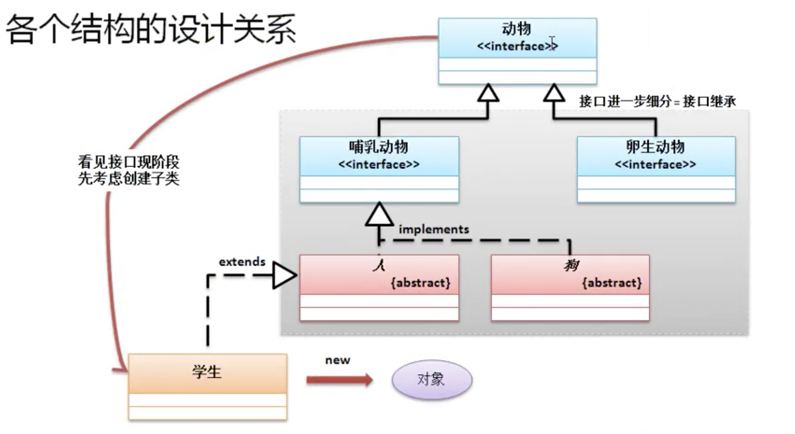

# 抽象类与接口的区别

*  在实际的开发中，抽象类与接口的定义形式非常相似，从jdk1.8开始j就特别明显，jdk1.8里接口也可以定义default，static方法

|N0.|区别|抽象类|接口|
|-----|------|-----|-----|
|1|定义|abstract class 抽象类名{}| interface 接口名{}|
|2|组成|构造方法、抽象方法、静态方法、普通方法、全局常量、成员(属性)|default普通方法、static方法、抽象方法、全局常量|
|3|权限|可以使用各种权限定义|public static final全局常量、public抽象方法|
|4|子类使用|extends继承一个抽象类|implements实现一个或多个接口|
|5|两者关系|抽象类可以实现若干个接口|接口不允许继承抽象类，但是可以继承多个父接口|
|6|使用|1、抽象类或接口必须定义子类。2、子类一定要覆写抽象类或接口中的抽象方法。3、通过子类的向上转型实现抽象类或接口的实例化|1、抽象类或接口必须定义子类。2、子类一定要覆写抽象类或接口中的抽象方法。3、通过子类的向上转型实现抽象类或接口的实例化|

* 当抽象类和接口都可以实现的情况下,优先考虑接口。因为接口可以避免子类的单继承。
* 从项目设计角度，也需要先从接口的角度来设计

