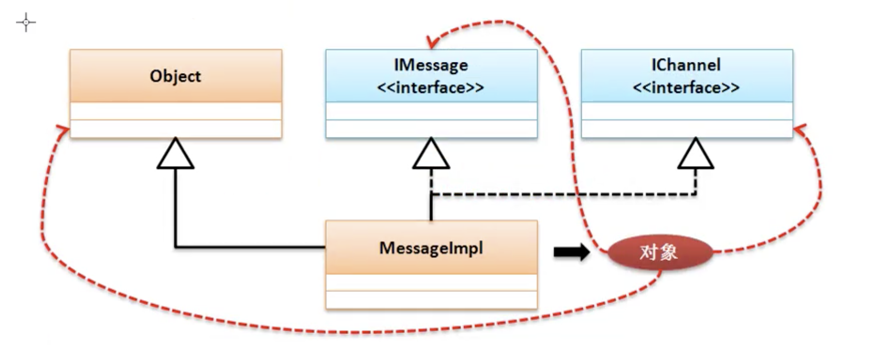

# 接口的基本定义

## 接口

* 接口 : 
    * 抽象类与普通类相比的优势： 可以实现对子类覆写方法的控制，但是在抽象类里可能会保留一些普通方法，而普通方法里可能会涉及到一些安全或隐私的操作问题，如果要对外部隐藏实现细节，就可以是用接口进行描述
    * 接口可以理解为一个纯粹的抽象类(最原始的定义接口之中是只包含有抽象方法和全局常量的)，从jdk1.8开始由于引入了lambda表达式的概念，所以接口的定义也得到了加强，除了抽象方法与全局变量之外还可以定义普通方法或静态方法，如果从设计本身的角度来讲，接口的组成还是应该以抽象方法和全局常量为主。
    * 接口使用interface关键字定义。
    * 由于接口名与类名的定义相同，为区分接口名与类名习惯性使用I开头(interface)
    ```java
        interface IMessage{ //接口名
            public static final String INFO = "info";//全局常量
            public abstract String getInfo(); //抽象方法
        }
    ```
* 接口的使用
    * 由于接口有抽象方法，无法直接实例化对象
    * 接口需要被子类实现(implements),一个子类可以实现多个父接口
    * 子类(如果不是抽象类),那么一定要覆写全部抽象方法
    * 接口对象可以利用子类对象的向上转型进行实例化
    * 接口子类名称定义习惯在末尾增加Impl
```java
    interface IMessage{ //接口名
        public static final String INFO = "info";//全局常量
        public abstract String getInfo(); //抽象方法
    }

    //implements 实现接口子类
    class MessageImpl implements IMessage{
        @Override
        public String getInfo(){
            return "覆写方法getInfo";
        }
    }

    public class JavaDemo05 {
        public static void main (String [] args){
            IMessage msg = new MessageImpl(); //向上转型
            System.out.println(msg.getInfo());//覆写方法getInfo
        }
    }
```

* 接口一个子类可是实现多个子类，也就是利用接口可实现多继承的概念

```java
    interface IMessage{ //接口名
        public static final String INFO = "info";//全局常量
        public abstract String getInfo(); //抽象方法
    }

    interface IChannel{
        public abstract boolean connect();
    }

    //implements 实现接口子类
    class MessageImpl implements IMessage,IChannel{
        @Override
        public String getInfo(){
            if(this.connect()){
                return "覆写方法getInfo";
            }
            return "覆写方法getInfo成功，通道链接失败";
        }

        @Override
        public boolean connect(){
            System.out.println("通道链接成功");
            return true;
        }
    }

    public class JavaDemo05 {
        public static void main (String [] args){
            IMessage msg = new MessageImpl(); //向上转型
            System.out.println(msg.getInfo());
            //通道链接成功
            //覆写方法getInfo
        }
    }
```



* 此时MessageImpl的子类可以实现任意父接口的子类转换

```java
    //MessageImpl 实现了IMessage，IChannel两个接口，所以子类MessageImpl 可以相互转换
    public class JavaDemo05 {
        public static void main(String[] args) {
            IMessage msg = new MessageImpl(); // 向上转型
            IChannel chl = (IChannel) msg ;
            System.out.println(chl.connect());
            // 通道链接成功
            // true
        }
    }
```

* 接口是不允许继承父类的，所以接口不会是Object的子类，因为接口的子类实现是Object的子类，所以接口可以通过Object接收。

```java
    public class JavaDemo05 {
        public static void main(String[] args) {
            Object msg = new MessageImpl(); // 向上转型
            System.out.println(((IMessage) msg).getInfo());
            // 通道链接成功
            // 覆写方法getInfo
        }
    }
```
* Obeject可以接收所有数据类型，基本类型、类对象、接口对象、数组。
* 由于接口描述的是一个公共的标准，所以在接口之中的所有抽象方法的范文权限全是public

* 实现接口类可以实现多个接口，一个普通类只能继承一个抽象类并且可以实现多个接口类，但是要求先继承后实现

```java

interface IMessage {
    public static final String INFO = "info";

    public abstract String getInfo();
}

interface IChannel {
    public abstract boolean connect();
}

abstract class  BaseDataAbstract {
    public abstract boolean connection();
}

// 先继承抽象类在实现接口
class MessageImpl extends BaseDataAbstract implements IMessage, IChannel {
    @Override
    public String getInfo() {
        if (this.connect()) {
            return "覆写方法getInfo";
        }
        return "覆写方法getInfo成功，通道链接失败";
    }

    @Override
    public boolean connect() {
        System.out.println("通道链接成功");
        return true;
    }

    @Override 
    public boolean connection(){
        return true;
    }
}

```

* 虽然接口无法继承一个父类，但是一个接口却可以通过extends继承若干个父接口，此时叫接口的多继承，

```java

interface IMessage{
    public abstract String getInfo();
}
interface IChannel{
    public abstract boolean channel();
}
interface IServers extends IMessage,IChannel{
    public abstract String server();
}

class MessageServersImpl implements IServers{
    @Override
    public String getInfo(){
        return "MessageServersImpl";
    }
    @Override
    public boolean channel(){
        return true;
    }
    @Override
    public String server(){
        return "链接成功";
    }
}
public class JavaDemo06 {
    public static void main(String [] args){

    }
}
```

* 接口的使用
    * 表示进行标准设置
    * 表示一种操作的能力
    * 暴露远程方法视图，一般都在RPC分布式开发时使用