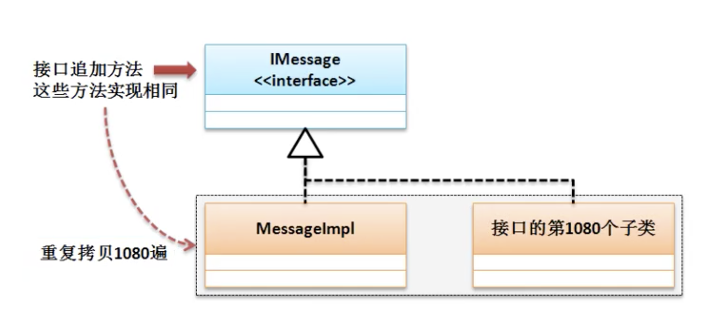

# 接口的定义加强

* 接口最早的主要特点是由抽象方法和全局常量所组成，如果涉及不当会出现严重问题，结构设计不当导致。



* 方法一 jdk1.8之前，在接口的实现类与接口之间追加抽象类，通过集成抽象类避免重复实现接口定义的抽象方法


* jdk1.8之后允许使用普通方法
    * 普通方法要用default

```java
    interface IMessage{
        public String message();
        //接口中的普通方法必须要有default操作
        public default boolean connect(){
            System.out.println("接口中的普通方法要用default修饰");
            return true;
        }
    }

    class MessageImpl implements IMessage{
        @Override
        public String message(){
            return "message";
        }
    }

    public class JavaDemo08{
        public static void main(String [] args){
            IMessage msg = new MessageImpl();
            if(msg.connect()){
                System.out.println(msg.message());
            }
            // 接口中的普通方法要用default修饰
            // message
        }
    }
```

* 接口中可以定义 static方法

```java
    interface IMessage{
        public String message();
        public default boolean connect(){
            System.out.println("接口中的普通方法要用default修饰");
            return true;
        }
        //接口中可以使定义static方法
        public static String getInfo(){
            return "接口的static方法";
        }
    }

    class MessageImpl implements IMessage{
        @Override
        public String message(){
            return "message";
        }
    }

    public class JavaDemo08{
        public static void main(String [] args){
            IMessage msg = new MessageImpl();
            if(msg.connect()){
                System.out.println(msg.message());
            }
            System.out.println(IMessage.getInfo());
            // 接口中的普通方法要用default修饰
            // message
            //接口的static方法
        }
    }

```

* 接口里可以使用普通方法和static方法，但是不应该作为接口的主要涉及原则。

## 接口的定义标准

* 


```java
    interface IUSB { // 定义usb标准
        public boolean check(); // 检查usb接口

        public String work();
    }

    class Computer {
        public void plugin(IUSB usb) {
            if (usb.check()) {
                System.out.println("硬件检查通过");
                System.out.println(usb.work());
            }else{
                System.out.println("硬件检未查通过");
            }
        }
    }

    class Keyboard implements IUSB {
        @Override
        public boolean check() {
            return true;
        }

        @Override
        public String work() {
            return "键盘可以使用";
        }
    }

    class Print implements IUSB{
        @Override
        public boolean check(){
            return false;
        }
        @Override
        public String work(){
            return "打印机可以使用";
        }
    }

    public class JavaDemo09 {
        public static void main(String[] args) {
            Computer c = new Computer();
            c.plugin(new Keyboard());//链接键盘
            c.plugin(new Print());//链接打印机
            // 硬件检查通过
            // 键盘可以使用
            // 硬件检未查通过
        }
    }

```