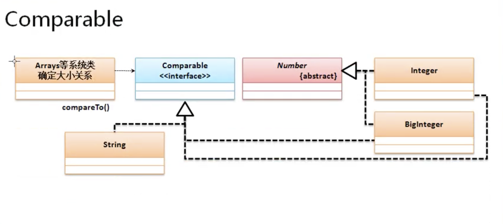
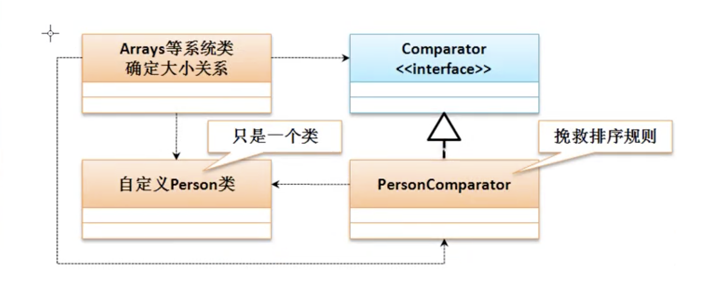

# 比较器

## 第13章 » 课时52 比较器问题引出

* 所谓的比较器指的是进行大小关系的确定

* 问题的引出
    * 如果要进行数组操作，java.util.Arrays的操作类来完成。这个类提供大多数数组的操作，还提供有一种对象数组的排序支持。
    * public static void sort​(Object[] a)

* 实现对象数组的排序

```java
import java.util.Arrays;

public class JavaDemo56 {
    public static void main(String[] args) {
        // 对象数组
        Integer data[] = new Integer[] { 10, 2, 5, 3, 9 };
        // 对象数组排序
        Arrays.sort(data);
        System.out.println(Arrays.toString(data));
        //[2, 3, 5, 9, 10]
    }
}
```

* 自定义类排序处理

* 运行时异常

    * class Person cannot be cast to class java.lang.Comparable
    * 没有实现Comparable方法
    * 任意一个类在默认情况下无法使用系统内部的类实现数组排序或者比较，因为没有明确的指出到底要如何比较的定义。(没有比较规则)，在java里为了统一比较规则的定义，所以提供有比较器的接口。Comparable接口

```java
import java.util.Arrays;
class Person {
    private String name;
    private int age;

    public Person(String name, int age) {
        this.name = name;
        this.age = age;
    }

    @Override
    public String toString() {
        return "name:" + this.name + "、age:" + this.age;
    }
}

public class JavaDemo56 {
    public static void main(String[] args) {
        Person data[] = new Person[3];
        data[0] = new Person("张三", 10);
        data[1] = new Person("李四", 11);
        data[2] = new Person("王五", 12);
        // 对象数组排序
        Arrays.sort(data);
        System.out.println(Arrays.toString(data));
        // Exception in thread "main" java.lang.ClassCastException: class Person cannot
        // be cast to class java.lang.Comparable (Person is in unnamed module of loader
        // 'app'; java.lang.Comparable is in module java.base of loader 'bootstrap')
        // at
        // java.base/java.util.ComparableTimSort.countRunAndMakeAscending(ComparableTimSort.java:320)
        // at java.base/java.util.ComparableTimSort.sort(ComparableTimSort.java:188)
        // at java.base/java.util.Arrays.sort(Arrays.java:1249)
        // at JavaDemo56.main(JavaDemo56.java:24)
    }
}
```

## 第13章 » 课时53 Comparable比较器

* 如果要实现对象的比较，需要有比较器来制定比较规则。而比较规则就通过Comparable来实现。对于Comparable而言需要知道其基本的定义结构。

```java
Module java.base
Package java.lang
Interface Comparable<T>

Method
int compareTo​(T o)

Since:
1.2
See Also:
Comparator

public interface Comparable<T>{
    /**
     * 实现比较器对象处理操作
     * @param o 需要比较的对象
     * @return  当前对象比传入的小返回负数，大返回正数，相等返回0
     */
    public int compareTo(T o);
}
```



```java

import java.util.Arrays;

class Person implements Comparable<Person> {
    private String name;
    private int age;

    public Person(String name, int age) {
        this.name = name;
        this.age = age;
    }

    @Override
    public String toString() {
        return "name:" + this.name + "、age:" + this.age;
    }

    public int getAge() {
        return age;
    }

    @Override
    public int compareTo(Person p) {
        return  p.age-this.age;
    }
}

public class JavaDemo56 {
    public static void main(String[] args) {
        Person data[] = new Person[3];
        data[0] = new Person("张三", 10);
        data[1] = new Person("李四", 11);
        data[2] = new Person("王五", 12);
        // 对象数组排序
        Arrays.sort(data);
        System.out.println(Arrays.toString(data));
        // [name:王五、age:12, name:李四、age:11, name:张三、age:10]
    }
}
```

* 排序里面只需要有一个CompareTo的方法进行排序规则的定义，而后整个java系统里面就可以为其实现排序处理了

## 第13章 » 课时54 Comparator比较器

* Comparator属于一种挽救的比较功能，其主要目的是解决一些没有使用Comparable接口排序的类的对象的数组排序操作。

* 🌰 由于项目已经开发完成，先期的设计并没有考虑到比较排序。没有实现Comparable接口。若干迭代后需要对该类进行排序但是又不能修改该类。
    * 这时候就可以使用Comparator
    * 在Arrays类里，排序有另外一种实现。
        * 基于Comparator的排序处理：public static <T> void sort​(T[] a, Comparator<? super T> c)

```java
Module java.base
Package java.util
Interface Comparator<T>

Method
int compare​(T o1, T o2)

```



```java

import java.util.Arrays;
import java.util.Comparator;

class Person {
    private String name;
    private int age;

    public Person(String name, int age) {
        this.name = name;
        this.age = age;
    }

    @Override
    public String toString() {
        return "name:" + this.name + "、age:" + this.age;
    }

    public int getAge() {
        return age;
    }
}

class PersonComparator implements Comparator<Person> {
    @Override
    public int compare(Person p, Person p2) {
        return p.getAge() - p2.getAge();
    }
}

public class JavaDemo56 {
    public static void main(String[] args) {
        Person data[] = new Person[3];
        data[0] = new Person("张三", 32);
        data[1] = new Person("李四", 11);
        data[2] = new Person("王五", 22);
        // 对象数组排序
        Arrays.sort(data,new PersonComparator());
        System.out.println(Arrays.toString(data));
        // [name:李四、age:11, name:王五、age:22, name:张三、age:32]
    }
}
```

* 对于排序操作如果不是必须的情况下，墙裂不建议使用Comparator，建议在类定义时就实现Comparable接口。

### Comparable与Comparator的区别

|comparabel|comparator|
|---|---|
|java.lang.Comparable是在类定义的时候实现的父接口，主要用于定义排序规则，只有一个compareTo的排序方法|java.util.Comparator是挽救的比较操作，需要设置单独的比较器规则类来实现排序，里面有compare方法|