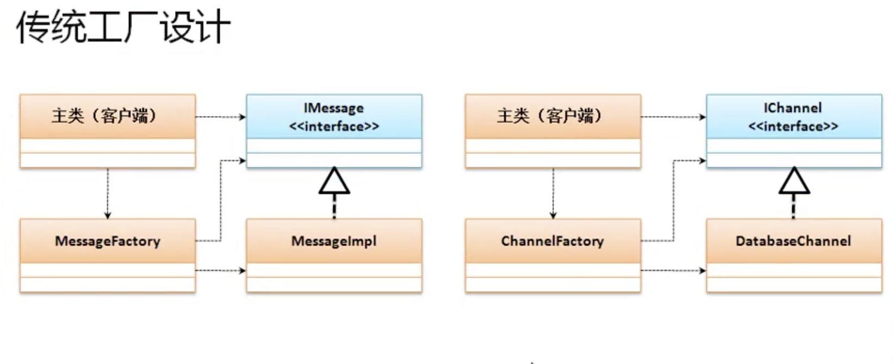
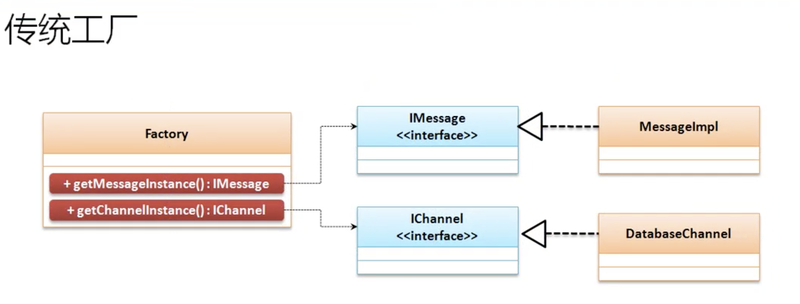

# 泛型

* jdk1.5之后java中追加了泛型，主要是为了解决ClassCastEx'ception的问题,在进行对象的向下转型时永远都可能存在安全隐患。java希望可以通过泛型慢慢解决掉此类问题。

## 泛型问题引出

* 描述x,y坐标的处理类，并允许保存三类数据。
    * 整型数据：x=10,y=20
    * 浮点型数据： x=10.1,y=20.9
    * 字符串型：x=东经20度,y=北纬30度
* 设计Point类需要考虑具体的x,y属性的类型,要求可以保存以上三种数据。
    * Object类定义
        * 整型数据： 基本数据 -> 经过包装 Integer类对象 -> 自动向上转型为Object
        * 浮点型数据： 基本数据 -> 经过包装 Double类对象 -> 自动向上转型为Object
        * 字符串型数据：  String类对象 -> 自动向上转型为Object

```java
class Point {
    private Object x;
    private Object y;

    public void setX(Object x) {
        this.x = x;
    }

    public void setY(Object y) {
        this.y = y;
    }

    public Object getX() {
        return this.x;
    }

    public Object getY() {
        return this.y;
    }
}

public class JavaDemo12 {
    public static void main(String[] args) {
        Point p = new Point();
        p.setX(10);// 自动装箱
        p.setY(20);
        // 获取x，y
        int x = (Integer) p.getX(); //拆箱，向下转型获取数据
        int y = (Integer) p.getY();
        System.out.println("x=" + x + "、y=" + y);
        // x=10、y=20
    }
}
```

* 以上可以解决，是因为Object可以接收所有的数据类型。但是会出现安全隐患。

```java
p.setX(10);// 自动装箱
p.setY("北纬30度");
```
<strong>编译的时候不会出现问题，程序执行时候就会出现ClassCastException,所以会存在安全隐患</strong>安全隐患存在的根本是因为Object可以接收所有类型。

## 泛型的基本定义

* 如果想要避免ClassCastException，最好避免掉对象的强制类型转换。
* <strong color='red'>泛型的本质，类中的属性或方法的参数与返回值可以由对象实例化时动态决定。</strong>此时在类定义时，就需要明确的占位符(泛型标记)

```java
class Point<T> { //T是Type的简写,可以定义多个泛型
    private T x;
    private T y;

    public void setX(T x) {
        this.x = x;
    }

    public void setY(T y) {
        this.y = y;
    }

    public T getX() {
        return this.x;
    }

    public T getY() {
        return this.y;
    }
}
```

* 此时Point中的x,y数据类型并不确定，而是由外部决定。
* 由于泛型是属于jdk1.5之后的,以前没有使用泛型，为了兼容以前，所以不设置泛型类型，默认是Object作为类型。但是编译会提示警告。
* <strong>泛型在定义完成后可以在实例化对象的时候,可以进行泛型类型的设置,一旦设置之后，使用泛型的类内部使用的类型就与当前对象直接绑定了</strong>

```java
public static void main(String[] args) {
    Point<Integer> p = new Point<Integer>();
    p.setX(10);// 自动装箱
    p.setY(20);
    // 获取x，y
    int x = p.getX();
    int y = p.getY();
    System.out.println("x=" + x + "、y=" + y);
    // x=10、y=20
}
```

* 泛型的类型设置，只使用当前p实例对象。这样编译时就可以发现类型错误，避免安全隐患

* 注意
    * 泛型之中只允许设置引用类型,如果要操作基本类型，必须使用包装类。
    * 从jdk1.7开始泛型实例化，可以简化为Point<Integer> p = new Point<>();

## 泛型通配符

* 问题：引用传递处理

```java
class Message<T> {
    private T content;

    public void setContent(T content) {
        this.content = content;
    }

    public T getContent() {
        return this.content;
    }
}

public class JavaDemo13 {
    public static void main(String args[]) {
        Message<String> c = new Message<String>();
        c.setContent("content");
        fun(c);
    }

    public static void fun(Message<String> temp) {
        System.out.println(temp.getContent());
    }
}
```

* 问题在fun方法上，使用泛型不可能是一种类型。上列只能够接收Message<String>类型

* 泛型通配符“？”可以获取泛型中的数据，但是不可以修改。

```java
public class JavaDemo13 {
    public static void main(String args[]) {
        Message<String> c = new Message<String>();
        c.setContent("content");
        fun(c);
        Message<Integer> d = new Message<Integer>();
        d.setContent(111);
        fun(d);
    }

    public static void fun(Message<?> temp) {
        System.out.println(temp.getContent());
    }
}
```

* "?"通配符扩展
    * ?extends 类：设置泛型的上限
        * ? extends Number ：表示该泛型只允许设置Number或Number的子类
    * ?super 类：设置泛型的下限
        * ? super String ：表示只能够使用String或其父类。

* 泛型上限🌰

```java

class Message<T extends Number> {//设置上限
    private T content;

    public void setContent(T content) {
        this.content = content;
    }

    public T getContent() {
        return this.content;
    }
}

public class JavaDemo13 {
    public static void main(String args[]) {
        // String会报错
        // Message<String> c = new Message<String>();
        // c.setContent("content");
        // fun(c);
        Message<Integer> d = new Message<Integer>();
        d.setContent(111);
        fun(d);
    }
    //? extends Number 设置上限
    public static void fun(Message<? extends Number> temp) {
        System.out.println(temp.getContent());
    }
}
```

* 泛型下限🌰

```java

class Message<T> {
    private T content;

    public void setContent(T content) {
        this.content = content;
    }

    public T getContent() {
        return this.content;
    }
}

public class JavaDemo13 {
    public static void main(String args[]) {
        Message<String> c = new Message<String>();
        c.setContent("content");
        fun(c);
        // Message<Integer> d = new Message<Integer>();
        // d.setContent(111);
        // fun(d);
    }
    //只能传递String或者String父类 Object
    public static void fun(Message<? super String> temp) {
        System.out.println(temp.getContent());
    }
}
```

## 泛型接口

```java
interface IMessage<T> {
    public String echo(T t);
}
```

* 对于泛型子类而言，有两种子类实现方式。
    * 方式一：在子类之中继续设置泛型定义。

    ```java
    interface IMessage<T> {
        public String echo(T t);
    }
    //实现接口是 继续使用泛型
    class MessageImpl<S> implements IMessage<S> {
        @Override
        public String echo(S t) {
            return "【echo】" + t;
        }
    }

    public class JavaDemo14 {
        public static void main(String[] args) {
            IMessage<String> msg = new MessageImpl<String>();
            System.out.println(msg.echo("123"));
            //【echo】123
        }
    }
    ```
    * 方式二： 在子类实现父接口的时候直接定义出具体的泛型
    
    ```java
        interface IMessage<T> {
            public String echo(T t);
        }
        // 实现接口 直接指定String
        class MessageImpl implements IMessage<String> {
            @Override
            public String echo(String t) {
                return "【echo】" + t;
            }
        }

        public class JavaDemo14 {
            public static void main(String[] args) {
                IMessage<String> msg = new MessageImpl();
                System.out.println(msg.echo("123"));
                //【echo】123
            }
        }
    ```

## 泛型方法

* 有泛型标记的方法

```java

public class JavaDemo15 {
    public static void main(String[] args) {
        Integer[] num = fun(1, 2, 3);
        for (int item : num) {
            System.out.println(item);
        }
    }

    public static <T> T[] fun(T... args) {
        return args;
    }
}
```



* 利用泛型改进工厂