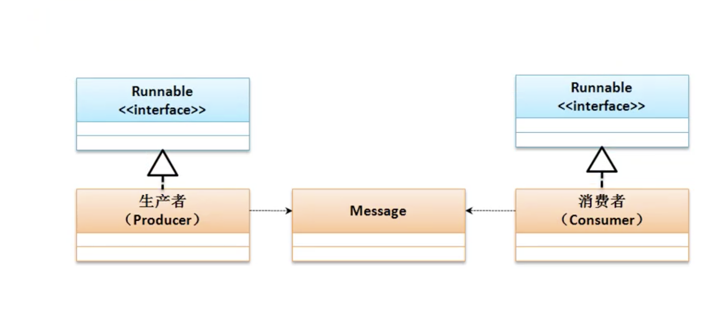

# 生产者与消费者基本程序模型

* 多线程开发中经典案例，生产者与消费者

    * 生产者负责信息内容的生产
    * 每当生产者完成一个信息的生产之后，消费者要取走信息
    * 如果生产者没有生产完成，消费者则要等待生产完成，反之同理，消费者没有处理完成之前，生产者要等待消费者处理完成在继续生产

## 程序的基本实现

* 生产者和消费者定义为两个独立的线程类对象

* 因为是两个独立的线程，就需要有一个数据保存的集中点



## 生产者和消费者同步问题

* 两个问题： 数据一致性和重复操作

* 数据同步
    * synchronized 同步代码块或方法
        * 问题 数据保持一致 重复操作依然存在

```java
class Message {
    private String title;
    private String content;

    public synchronized void set(String title, String content) {
        this.title = title;
        this.content = content;
    }

    public synchronized String get() {
        return this.title + " - " + this.content;
    }

}

class Producter implements Runnable {
    private Message msg;

    public Producter(Message msg) {
        this.msg = msg;
    }

    @Override
    public void run() {
        for (int i = 0; i < 5; i++) {
            if (i % 2 == 0) {
                this.msg.set("张三", "我是张三");
            } else {
                this.msg.set("李四", "我是李四");
            }
        }
    }
}

class Consumer implements Runnable {
    private Message msg;

    public Consumer(Message msg) {
        this.msg = msg;
    }

    @Override
    public void run() {
        for (int i = 0; i < 5; i++) {
            System.out.println(this.msg.get());
        }
    }
}

public class JavaDemo40 {
    public static void main(String[] args) {
        Message msg = new Message();
        Runnable p = new Producter(msg);
        Runnable c = new Consumer(msg);
        new Thread(p).start();
        new Thread(c).start();

    }
}
```

## 利用Object类解决重复操作

* 解决重复操作机制，就是使用等待与唤醒操作。等待与唤醒操作主要依靠Object中提供的方法处理的

    * 等待 ： <strong> public final void wait​() throws InterruptedException</strong>
        * wait 参数 可设置等待时间，等待超时时间

    * 唤醒第一个等待线程 ： <strong> public final void notify​()</strong>

    * 唤醒全部等待线程 ： <strong> public final void notifyAll()</strong> 
        * 唤醒所有等待的线程，那个线程优先级高就有可能先执行

```java
class Message {
    private String title;
    private String content;
    private Boolean flag = true;

    // flag = true 可以生产 ，不可以消费 ，false 可以消费，不可生产
    public synchronized void set(String title, String content) {
        if (!this.flag) {
            try {
                super.wait();
            } catch (Exception e) {
                e.printStackTrace();
            }
        }
        try {
            Thread.sleep(500);
        } catch (Exception e) {
        }
        this.title = title;
        this.content = content;
        this.flag = false;
        super.notify();
    }

    public synchronized String get() {
        if (this.flag) {
            try {
                super.wait();
            } catch (Exception e) {
                e.printStackTrace();
            }
        }
        try {
            return this.title + " - " + this.content;
        } finally {
            this.flag = true;
            super.notify();
        }
    }

}

class Producter implements Runnable {
    private Message msg;

    public Producter(Message msg) {
        this.msg = msg;
    }

    @Override
    public void run() {
        // try {
        // Thread.sleep(300);
        // } catch (Exception e) {
        // e.printStackTrace();
        // }
        for (int i = 0; i < 5; i++) {
            if (i % 2 == 0) {
                this.msg.set("张三", "我是张三");
            } else {
                this.msg.set("李四", "我是李四");
            }
        }
    }
}

class Consumer implements Runnable {
    private Message msg;

    public Consumer(Message msg) {
        this.msg = msg;
    }

    @Override
    public void run() {
        for (int i = 0; i < 5; i++) {
            System.out.println(this.msg.get());
        }
    }
}

public class JavaDemo40 {
    public static void main(String[] args) {
        Message msg = new Message();
        Runnable p = new Producter(msg);
        Runnable c = new Consumer(msg);
        new Thread(p).start();
        new Thread(c).start();

    }
}
```