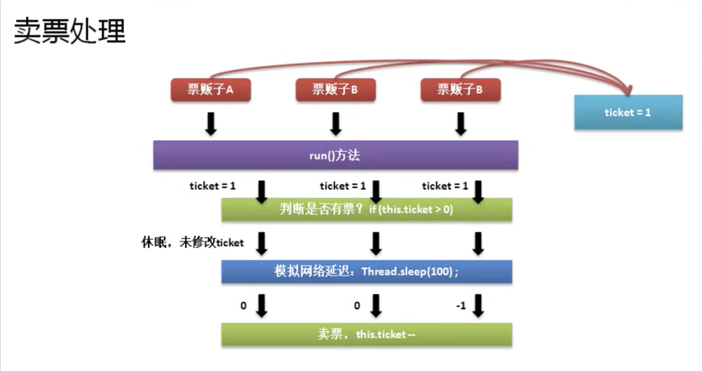
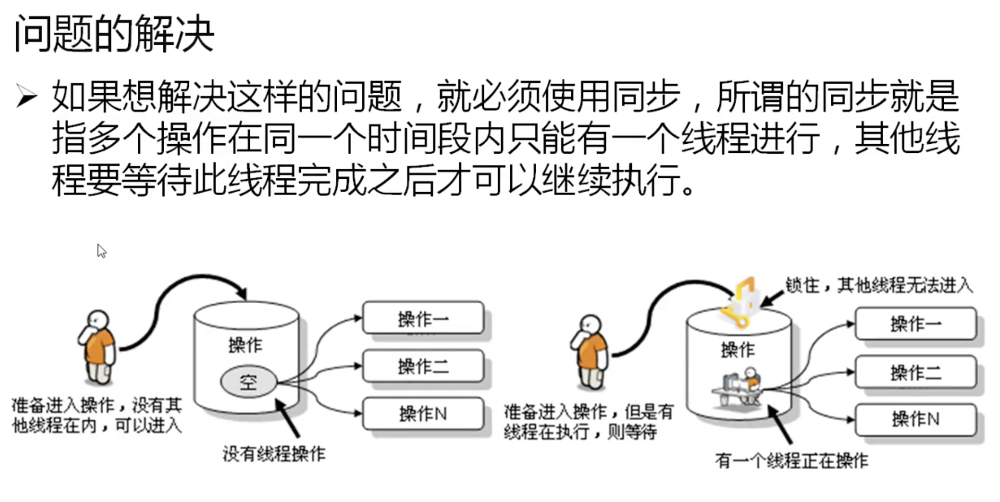

# 线程的同步与死锁

* 在对线程的处理之中，可以利用Runnable描述多个线程操作的资源。而Thread描述每一个线程对象。于是当多个线程访问同一个资源，如果数据处理不当就会产生数据的错误。

* 问题引出

```java


class MyThread implements Runnable {
    private int ticket = 10;

    @Override
    public void run() {
        while (true) {
            if (this.ticket > 0) {
                try {
                    Thread.sleep(100);
                } catch (Exception e) {
                    e.printStackTrace();
                }
                System.out.println(Thread.currentThread().getName() + "卖票、ticket=" + this.ticket--);
            } else {
                System.out.println("票卖光了");
                break;
            }
        }
    }
}

public class JavaDemo39 {
    public static void main(String[] args) {
        MyThread mt = new MyThread();
        new Thread(mt, "卖票员A").start();
        new Thread(mt, "卖票员B").start();
        new Thread(mt, "卖票员C").start();
        // 卖票员B卖票、ticket=9
        // 卖票员A卖票、ticket=10
        // 卖票员C卖票、ticket=8
        // 卖票员A卖票、ticket=7
        // 卖票员C卖票、ticket=6
        // 卖票员B卖票、ticket=7
        // 卖票员C卖票、ticket=5
        // 卖票员A卖票、ticket=5
        // 卖票员B卖票、ticket=5
        // 卖票员C卖票、ticket=4
        // 卖票员B卖票、ticket=4
        // 卖票员A卖票、ticket=4
        // 卖票员A卖票、ticket=2
        // 卖票员B卖票、ticket=3
        // 卖票员C卖票、ticket=3
        // 卖票员B卖票、ticket=-1
        // 票卖光了
        // 卖票员A卖票、ticket=1
        // 票卖光了
        // 卖票员C卖票、ticket=0
        // 票卖光了
    }
}
```
* 需要模拟延迟操作,暴露问题，实际上问题一直存在。



## 线程同步处理

* 解决同步问题的关键是锁，指的是说当某一个线程执行操作的时候，其他线程外面等待。



### 锁 synchronized

* 实现同步锁功能关键字 ： synchronized 
    * 利用此关键字可以定义同步代码块、同步方法，在同步操作代码块里的操作只允许一个线程操作执行。
    * 使用方法 : 同步对象一般采用当前对象
    ```java
        synchronized (同步对象){
            同步代码
        }
    ```

* 卖票问题解决方法

```java

class MyThread implements Runnable {
    private int ticket = 10;

    @Override
    public void run() {
        while (true) { // 每一次只允许一个线程进行访问
            synchronized (this) {
                if (this.ticket > 0) {
                    try { // 模拟网络延迟
                        Thread.sleep(100);
                    } catch (Exception e) {
                        e.printStackTrace();
                    }
                    System.out.println(Thread.currentThread().getName() + "卖票、ticket=" + this.ticket--);
                } else {
                    System.out.println("票卖光了");
                    break;
                }
            }
        }
    }
}

public class JavaDemo39 {
    public static void main(String[] args) {
        MyThread mt = new MyThread();
        new Thread(mt, "卖票员A").start();
        new Thread(mt, "卖票员B").start();
        new Thread(mt, "卖票员C").start();
        // 卖票员A卖票、ticket=10
        // 卖票员A卖票、ticket=9
        // 卖票员A卖票、ticket=8
        // 卖票员A卖票、ticket=7
        // 卖票员A卖票、ticket=6
        // 卖票员A卖票、ticket=5
        // 卖票员A卖票、ticket=4
        // 卖票员A卖票、ticket=3
        // 卖票员A卖票、ticket=2
        // 卖票员A卖票、ticket=1
        // 票卖光了
        // 票卖光了
        // 票卖光了
    }
}
```

### 加入同步处理后，系统性能降低

### 使用同步方法

* 方法名前加入synchronized关键字

```java

class MyThread implements Runnable {
    private int ticket = 10;

    @Override
    public void run() {
        this.sellTicket();
    }

    private synchronized void sellTicket() {
        while (true) { // 每一次只允许一个线程进行访问
            if (this.ticket > 0) {
                try { // 模拟网络延迟
                    Thread.sleep(100);
                } catch (Exception e) {
                    e.printStackTrace();
                }
                System.out.println(Thread.currentThread().getName() + "卖票、ticket=" + this.ticket--);
            } else {
                System.out.println("票卖光了");
                break;
            }
        }
    }
}

public class JavaDemo39 {
    public static void main(String[] args) {
        MyThread mt = new MyThread();
        new Thread(mt, "卖票员A").start();
        new Thread(mt, "卖票员B").start();
        new Thread(mt, "卖票员C").start();
        // 卖票员A卖票、ticket=10
        // 卖票员A卖票、ticket=9
        // 卖票员A卖票、ticket=8
        // 卖票员A卖票、ticket=7
        // 卖票员A卖票、ticket=6
        // 卖票员A卖票、ticket=5
        // 卖票员A卖票、ticket=4
        // 卖票员A卖票、ticket=3
        // 卖票员A卖票、ticket=2
        // 卖票员A卖票、ticket=1
        // 票卖光了
        // 票卖光了
        // 票卖光了
    }
}
```

## 线程死锁

* 死锁是在进行多线程同步的处理之中有可能产生的一种问题。
* 死锁： 若干个线程彼此互相等待的状态。

* 造成死锁的主要原因是互相等待

#### 若干个线程访问统一资源时一定要进行同步处理，而过多的同步处理会造成死锁。