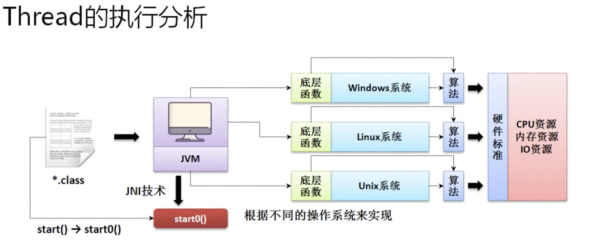

# 进程与线程

* 在java语言中最大的特点是支持多线程的开发

    * 多进程： 同一时间段内可执行多个程序
    * 线程 ： 线程是进程基础上划分的更小的程序单元，线程是在进程基础上创建并且使用的。线程的启动速度要比进程快，多线程处理并发请求的时候，要高于进程的执行

## Thread类实现多线程

* java之中实现多线程，需要专门的线程主体类，必须实现特定的接口或继承特定的父类才可以完成

* 继承Thread类实现多线程
    * java.lang.Thread 的程序类，只要一个类继承了该类，就为线程的主体类。
    * 需要重写run方法，线程的主方法
        * public void run​()

```java

class MyThread extends Thread { // 线程的主体类
    private String title;

    public MyThread(String title) {
        this.title = title;
    }

    @Override
    public void run() { // 线程的主体方法
        // super.run();
        for (int i = 0; i < 5; i++) {
            System.out.println(this.title + "i=" + i);
        }
    }
}

public class JavaDemo35 {
    public static void main(String[] args) {
        new MyThread("线程A").run();
        new MyThread("线程B").run();
        new MyThread("线程C").run();
        // 调用run线性执行，并没有交替执行
        // 线程Ai=0
        // 线程Ai=1
        // 线程Ai=2
        // 线程Ai=3
        // 线程Ai=4
        // 线程Bi=0
        // 线程Bi=1
        // 线程Bi=2
        // 线程Bi=3
        // 线程Bi=4
        // 线程Ci=0
        // 线程Ci=1
        // 线程Ci=2
        // 线程Ci=3
        // 线程Ci=4
        new MyThread("线程A").start();
        new MyThread("线程B").start();
        new MyThread("线程C").start();
        // 调用start 多线程启动
        // 线程Ci=0
        // 线程Ci=1
        // 线程Bi=0
        // 线程Bi=1
        // 线程Ai=0
        // 线程Ai=1
        // 线程Bi=2
        // 线程Ci=2
        // 线程Ci=3
        // 线程Bi=3
        // 线程Ai=2
        // 线程Ai=3
        // 线程Bi=4
        // 线程Ci=4
        // 线程Ai=4

    }
}
```

* 正常情况下要使用一个类中方法，需要产生实例化对象而后去调用类中提供的方法。run方法是不能够被直接调用的。因为涉及到操作系统的资源调度问题，要想启动多线性必须使用start方法完成。
    * public void start​()

* 虽然调用的是start方法但是最终执行的是run方法，所有线程的对象是交替执行的

### 为什么多线程的启动不用run方法，而是用Thread类中的start方法

* 打开start源代码查看

```java
public synchronized void start() {
        if (threadStatus != 0) //判断线程的状态
            throw new IllegalThreadStateException(); //抛出异常

        group.add(this);

        boolean started = false;
        try {
            start0(); // start方法里调用start0方法
            started = true;
        } finally {
            try {
                if (!started) {
                    group.threadStartFailed(this);
                }
            } catch (Throwable ignore) {
            }
        }
    }
    private native void start0(); //只定义了方法名称 和 使用native修饰

```

* 发现抛出一个异常类对象 IllegalThreadStateException，但是整个程序并没有throws明确的try...catch异常处理，该异常一定是runTimeException的子类，没一个线程类对象只允许启动一次，如果重复启动就抛出次异常
* 🌰

```java
MyThread mt = new MyThread("test");
        mt.start();
        mt.start();

//      Exception in thread "main" java.lang.IllegalThreadStateException
// 	at java.base/java.lang.Thread.start(Thread.java:794)
// 	at JavaDemo35.main(JavaDemo35.java:25)
// testi=0
// testi=1
// testi=2
// testi=3
// testi=4
```

* 在java程序执行当中考虑到了不同层次开发者的需求，所以其支持有本地的操作系统函数调用，而这项技术就被称为JNI(Java Native Interface)技术，但是java开发过程中不推荐使用，利用这样的技术可以使用操作系统的底层函数进程一些特殊的处理，而在Thread类中提供的start0方法就表示需要将此方法依赖于不同的操作系统实现



* 任何情况下，只要定义了多线程，多线程的启动只有一种方案：Thread类中的start()方法

## Runnable接口实现多线程

* 由于继承会有单继承局限，java里又提供第二种多线程主体定义结构
    * java.lang.Runnable接口

    ```java
        @FunctionalInterface
        public interface Runnable
    ```

* 🌰

```java
// @FunctionalInterface //jdk1.8之后就变为了函数式接口
// public interface Runnable{
// @Override
// public void run();
// }

public class JavaDemo35 {
    public static void main(String[] args) {
        Runnable rn = () -> {//线程方法主体
            for (int i = 0; i < 5; i++) {
                System.out.println("i=" + i);
            }
        };
        rn.run();
        // i=0
        // i=1
        // i=2
        // i=3
        // i=4
    }
}
```

* 由于不再继承Thread父类，就没有start方法了，如果不使用start方法无法进行多线程启动。但是Thread类的构造方法可以接收Runnable
    * public Thread​(Runnable target)

```java

class MyThread implements Runnable { // 线程的主体类
    private String title;

    public MyThread(String title) {
        this.title = title;
    }

    @Override
    public void run() { // 线程的主体方法
        // super.run();
        for (int i = 0; i < 5; i++) {
            System.out.println(this.title + "i=" + i);
        }
    }
}

// @FunctionalInterface //jdk1.8之后就变为了函数式接口
// public interface Runnable{
// @Override
// public void run();
// }

public class JavaDemo35 {
    public static void main(String[] args) {
        new Thread(new MyThread("线程A")).start();
        new Thread(new MyThread("线程B")).start();
        new Thread(new MyThread("线程C")).start();
        // 线程Bi=0
        // 线程Bi=1
        // 线程Ci=0
        // 线程Ai=0
        // 线程Ai=1
        // 线程Ci=1
        // 线程Bi=2
        // 线程Ci=2
        // 线程Ci=3
        // 线程Ai=2
        // 线程Ci=4
        // 线程Bi=3
        // 线程Ai=3
        // 线程Bi=4
        // 线程Ai=4

    }
}

```

* 这个时候的实现只是实现了Runnable的接口，所以此线程类的主体上不再有单继承的局限，这样的设计才是一个标准型的设计

* 可以发现 从jdk1.8开始 Runnable使用了函数式的接口定义，可以直接利用lamda

```java
for (int x = 0; x < 3; x++) {
            String title = "线程-" + x;
            Runnable rn = new Runnable() {
                @Override
                public void run() {
                    for (int i = 0; i < 5; i++) {
                        System.out.println(title + "i=" + i);
                    }
                }
            };
            new Thread(rn).start();
        }
        // 线程-1i=0
        // 线程-1i=1
        // 线程-1i=2
        // 线程-2i=0
        // 线程-0i=0
        // 线程-2i=1
        // 线程-2i=2
        // 线程-1i=3
        // 线程-2i=3
        // 线程-0i=1
        // 线程-2i=4
        // 线程-1i=4
        // 线程-0i=2
        // 线程-0i=3
        // 线程-0i=4
```

* 多线程优先考虑Runnable实现，永远是Thread类启动多线程。