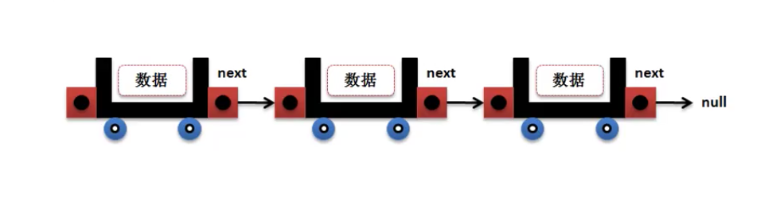
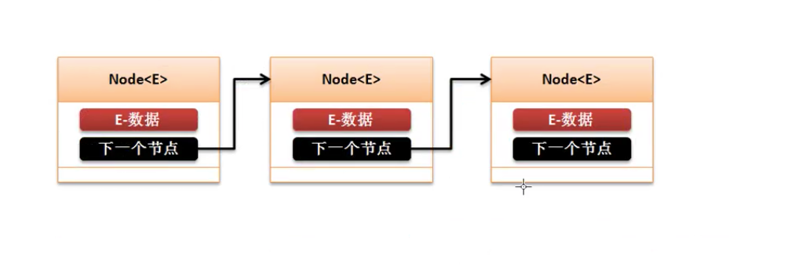
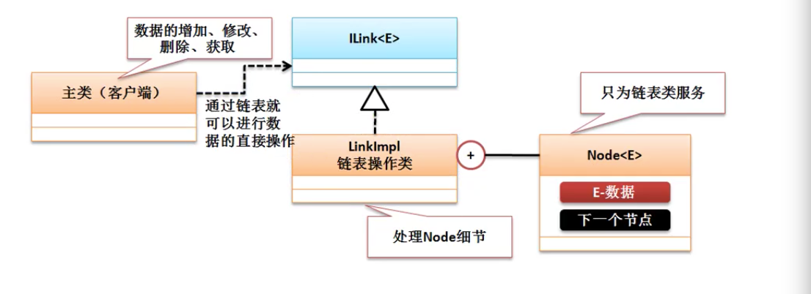

# 链表

* 链表的本质是一个动态的对象数组,可以实现若干个对象的存储

## 链表的基本定义

* 实际的开发之中 对象数组是一个非常实用的技术，利用其可以描述出”多“方的概念。

### 对象数组

* 传统的对象数组依赖于脚标(索引)操作数据，实现内容的动态维护难度大。
    * 对于不变的数据可以使用对象数据
    * 对于变化的数据需要使用可以扩充的对象数组

### 链表

* 利用引用的逻辑关系实现类似数组的逻辑操作

    

    

    * 公共的数据存储结构
        * 节点： 节点类

```java

class Node<E> {
    private E data;
    private Node<E> next = null;

    public Node(E data) {
        this.data = data;
    };

    public E getdata() {
        return this.data;
    }

    public void setData(E data) {
        this.data = data;
    }

    public Node<E> getNext() {
        return this.next;
    }

    public void setNext(Node<E> next) {
        this.next = next;
    }
}

public class JavaDemo32 {
    public static void main(String args[]) {
        Node<String> n1 = new Node<>("n1");
        Node<String> n2 = new Node<>("n2");
        Node<String> n3 = new Node<>("n3");
        n1.setNext(n2);
        n2.setNext(n3);
        print(n1);
        // n1
        // n2
        // n3
    }

    public static void print(Node<?> node) {
        if (node.getdata() != null) {
            System.out.println(node.getdata());
        }
        if (node.getNext() != null) {
            print(node.getNext());
        }
    }
}
```

* 使用只关系数据的操作，不关系节点，所以要实现对node的处理

