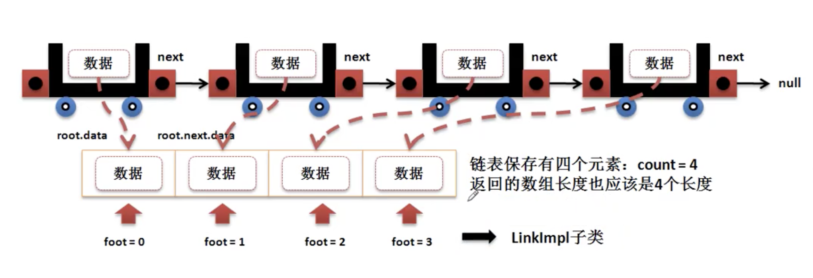

# 链表

* 链表的本质是一个动态的对象数组,可以实现若干个对象的存储

## 链表的基本定义

* 实际的开发之中 对象数组是一个非常实用的技术，利用其可以描述出”多“方的概念。

### 对象数组

* 传统的对象数组依赖于脚标(索引)操作数据，实现内容的动态维护难度大。
    * 对于不变的数据可以使用对象数据
    * 对于变化的数据需要使用可以扩充的对象数组

### 链表

* 利用引用的逻辑关系实现类似数组的逻辑操作

    

    

    * 公共的数据存储结构
        * 节点： 节点类

```java

class Node<E> {
    private E data;
    private Node<E> next = null;

    public Node(E data) {
        this.data = data;
    };

    public E getdata() {
        return this.data;
    }

    public void setData(E data) {
        this.data = data;
    }

    public Node<E> getNext() {
        return this.next;
    }

    public void setNext(Node<E> next) {
        this.next = next;
    }
}

public class JavaDemo32 {
    public static void main(String args[]) {
        Node<String> n1 = new Node<>("n1");
        Node<String> n2 = new Node<>("n2");
        Node<String> n3 = new Node<>("n3");
        n1.setNext(n2);
        n2.setNext(n3);
        print(n1);
        // n1
        // n2
        // n3
    }

    public static void print(Node<?> node) {
        if (node.getdata() != null) {
            System.out.println(node.getdata());
        }
        if (node.getNext() != null) {
            print(node.getNext());
        }
    }
}
```

* 使用只关系数据的操作，不关系节点，所以要实现对node的处理


## 链表的数据保存

* 通过之前分析得到

    * 为了避免转型的问题使用 ： 泛型
    * 需要一个链表的执行标准 ： 接口
    * 通过Node类做出节点的关系描述外部不可见： Node内部类

```java

interface ILink<E> { // 设置泛型避免安全隐患
    public void add(E e);
}

class LinkImpl<E> implements ILink<E> {

    private class Node { // 内部Node类 外部不可见 保存节点数据关系
        private E data; // 保存数据
        private Node next; // 保存下一个引用

        public Node(E data) {
            this.data = data;
        }
        //将节点保存在合适的位置
        public void addNode(Node newNode){
            if(this.next == null){ //如果当前节点next为空 保存
                this.next = newNode;
            }else{//调用当前next节点继续递归判断
                this.next.addNode(newNode);
            }
        }
        // ---------------没有添加getter 和 setter 方法 是因为内部类的私有属性也方便外部类直接访问-------
    }

    // ---------------Link类中结构定义的成员-------
    private Node root; // 保存根元素
    // ---------------Link类中结构定义的方法-------

    @Override
    public void add(E e) {
        if (e == null) {
            return; // 数据为空 直接返回
        }
        // 因为数据本身不具有关联性，所以要把数据封装在Node类中
        Node newNode = new Node(e);
        if (this.root == null) { //没有根节点
            this.root = newNode;
        }else{
            this.root.addNode(newNode);
        }
    }
}

```

## 链表的数据长度 public int size()

* ILink 接口里追加一个获取数据个数的方法
    * public int size()
* LinkImpl 中增加统计个数的属性 count

```java

interface ILink<E> { // 设置泛型避免安全隐患
    public void add(E e);

    public int size();// 获取数据个数
}

class LinkImpl<E> implements ILink<E> {

    private class Node { // 内部Node类 外部不可见 保存节点数据关系
        private E data; // 保存数据
        private Node next; // 保存下一个引用

        public Node(E data) {
            this.data = data;
        }

        // 将节点保存在合适的位置
        public void addNode(Node newNode) {
            if (this.next == null) { // 如果当前节点next为空 保存
                this.next = newNode;
            } else {// 调用当前next节点继续递归判断
                this.next.addNode(newNode);
            }
        }

        // ---------------没有添加getter 和 setter 方法 是因为内部类的私有属性也方便外部类直接访问-------
    }

    // ---------------Link类中结构定义的成员-------
    private Node root; // 保存根元素
    private int count;
    // ---------------Link类中结构定义的方法-------

    @Override // 增加node
    public void add(E e) {
        if (e == null) {
            return; // 数据为空 直接返回
        }
        this.count++;
        // 因为数据本身不具有关联性，所以要把数据封装在Node类中
        Node newNode = new Node(e);
        if (this.root == null) { // 没有根节点
            this.root = newNode;
        } else {
            this.root.addNode(newNode);
        }
    }

    @Override // 获取node个数
    public int size() {
        return this.count;
    }
}

public class JavaDemo33 {
    public static void main(String args[]) {
        LinkImpl<String> n = new LinkImpl<>();
        n.add("No1");
        n.add("No2");
        n.add("No3");
        System.out.println(n.size());
    }
}
```

## 空集合判断 public Boolean isEmpty()

* 链表里还没有保存数据表示空集合

## 返回数据集合 public Object [] toArray()



```java

interface ILink<E> { // 设置泛型避免安全隐患
    public void add(E e);

    public int size();// 获取数据个数

    public Boolean isEmpty(); // 判断是否为空

    public Object[] toArray(); // 返回数据集合
}

class LinkImpl<E> implements ILink<E> {

    private class Node { // 内部Node类 外部不可见 保存节点数据关系
        private E data; // 保存数据
        private Node next; // 保存下一个引用

        public Node(E data) {
            this.data = data;
        }

        // 将节点保存在合适的位置
        public void addNode(Node newNode) {
            if (this.next == null) { // 如果当前节点next为空 保存
                this.next = newNode;
            } else {// 调用当前next节点继续递归判断
                this.next.addNode(newNode);
            }
        }

        public void toArrayNode() {
            LinkImpl.this.nodeList[LinkImpl.this.foot++] = this.data;
            if (this.next != null) {
                this.next.toArrayNode();
            }
        }
        // ---------------没有添加getter 和 setter 方法 是因为内部类的私有属性也方便外部类直接访问-------
    }

    // ---------------Link类中结构定义的成员-------
    private Node root; // 保存根元素
    private int count;
    private Object[] nodeList;
    private int foot;
    // ---------------Link类中结构定义的方法-------

    @Override // 增加node
    public void add(E e) {
        if (e == null) {
            return; // 数据为空 直接返回
        }
        this.count++;
        // 因为数据本身不具有关联性，所以要把数据封装在Node类中
        Node newNode = new Node(e);
        if (this.root == null) { // 没有根节点
            this.root = newNode;
        } else {
            this.root.addNode(newNode);
        }
    }

    @Override // 获取node个数
    public int size() {
        return this.count;
    }

    @Override
    public Boolean isEmpty() {
        return this.count == 0;
        // return this.root == null;
    }

    @Override
    public Object[] toArray() {
        if (this.count == 0) {
            return null;
        } else {
            this.nodeList = new Object[this.count];
            // list.push(this.root);
            this.root.toArrayNode();
            return this.nodeList;
        }
    }
}

public class JavaDemo33 {
    public static void main(String args[]) {
        LinkImpl<String> n = new LinkImpl<>();
        System.out.println("【增加之前】 链表个数= " + n.size() + "、是否为空" + n.isEmpty());
        n.add("No1");
        n.add("No2");
        n.add("No3");
        for (Object item : n.toArray()) {
            System.out.println(item);
        }
        System.out.println("【增加之后】 链表个数= " + n.size() + "、是否为空" + n.isEmpty());

    }
}
```

## 根据所以获取数据 public E get(int index)

```java

interface ILink<E> { // 设置泛型避免安全隐患
    public void add(E e);

    public int size();// 获取数据个数

    public Boolean isEmpty(); // 判断是否为空

    public Object[] toArray(); // 返回数据集合

    public E get(int index); // 获取指定索引数据
}

class LinkImpl<E> implements ILink<E> {

    private class Node { // 内部Node类 外部不可见 保存节点数据关系
        private E data; // 保存数据
        private Node next; // 保存下一个引用

        public Node(E data) {
            this.data = data;
        }

        // 将节点保存在合适的位置
        public void addNode(Node newNode) {
            if (this.next == null) { // 如果当前节点next为空 保存
                this.next = newNode;
            } else {// 调用当前next节点继续递归判断
                this.next.addNode(newNode);
            }
        }

        public void toArrayNode() {
            LinkImpl.this.nodeList[LinkImpl.this.foot++] = this.data;
            if (this.next != null) {
                this.next.toArrayNode();
            }
        }

        public E getIndex(int index) {
            System.out.println(index);
            System.out.println(LinkImpl.this.foot);

            if (LinkImpl.this.foot++ == index) {
                return this.data;
            } else {
                return this.next.getIndex(index);
            }
        }

        // ---------------没有添加getter 和 setter 方法 是因为内部类的私有属性也方便外部类直接访问-------
    }

    // ---------------Link类中结构定义的成员-------
    private Node root; // 保存根元素
    private int count;
    private Object[] nodeList;
    private int foot;
    // ---------------Link类中结构定义的方法-------

    @Override // 增加node
    public void add(E e) {
        if (e == null) {
            return; // 数据为空 直接返回
        }
        this.count++;
        // 因为数据本身不具有关联性，所以要把数据封装在Node类中
        Node newNode = new Node(e);
        if (this.root == null) { // 没有根节点
            this.root = newNode;
        } else {
            this.root.addNode(newNode);
        }
    }

    @Override // 获取node个数
    public int size() {
        return this.count;
    }

    @Override
    public Boolean isEmpty() {
        return this.count == 0;
        // return this.root == null;
    }

    @Override
    public Object[] toArray() {
        if (this.count == 0) {
            return null;
        } else {
            this.nodeList = new Object[this.count];
            // list.push(this.root);
            this.root.toArrayNode();
            return this.nodeList;
        }
    }

    @Override
    public E get(int index) {
        if (index >= this.count) {
            return null;
        }
        // Object data = this.toArray();
        this.foot = 0;
        return this.root.getIndex(index);
    }
}

public class JavaDemo33 {
    public static void main(String args[]) {
        LinkImpl<String> n = new LinkImpl<>();
        System.out.println("【增加之前】 链表个数= " + n.size() + "、是否为空" + n.isEmpty());
        n.add("No1");
        n.add("No2");
        n.add("No3");
        for (Object item : n.toArray()) {
            System.out.println(item);
        }
        System.out.println("【增加之后】 链表个数= " + n.size() + "、是否为空" + n.isEmpty());
        System.out.println(n.get(1));
    }
}
```

## 修改指定所以数据 public void set(int index, E data)

## 判断指定数据是否存在 public Boolean contains(E data)

* 使用对象比较方法判断(equals())
* 链表数据不为空null

## 数据的删除 public void remove(E data)

* 要删除的是根节点
* 删除的不是跟节点

```java

interface ILink<E> { // 设置泛型避免安全隐患
    public void add(E e);

    public int size();// 获取数据个数

    public Boolean isEmpty(); // 判断是否为空

    public Object[] toArray(); // 返回数据集合

    public E get(int index); // 获取指定索引数据

    public void set(int index, E data); // 修改指定数据

    public Boolean contains(E data);// 判断指定数据是否存在

    public void remove(E data); // 数据的删除
}

class LinkImpl<E> implements ILink<E> {

    private class Node { // 内部Node类 外部不可见 保存节点数据关系
        private E data; // 保存数据
        private Node next; // 保存下一个引用

        public Node(E data) {
            this.data = data;
        }

        // 将节点保存在合适的位置
        public void addNode(Node newNode) {
            if (this.next == null) { // 如果当前节点next为空 保存
                this.next = newNode;
            } else {// 调用当前next节点继续递归判断
                this.next.addNode(newNode);
            }
        }

        public void toArrayNode() {
            LinkImpl.this.nodeList[LinkImpl.this.foot++] = this.data;
            if (this.next != null) {
                this.next.toArrayNode();
            }
        }

        public E getIndex(int index) {
            if (LinkImpl.this.foot++ == index) {
                return this.data;
            } else {
                return this.next.getIndex(index);
            }
        }

        public void setIndex(int index, E data) {
            if (LinkImpl.this.foot++ == index) {
                this.data = data;
            } else {
                this.next.setIndex(index, data);
            }
        }

        public Boolean equalsNode(E data) {
            if (data.equals(this.data)) {
                return true;
            } else {
                if (this.next == null) {
                    return false;
                }
                return this.next.equalsNode(data);
            }
        }

        public void removeNode(Node preNode, E data) {
            if (this.data.equals(data)) {
                preNode.next = this.next;
            } else {
                if (preNode.next != null) {
                    this.next.removeNode(this, data);
                }
            }
        }
        // ---------------没有添加getter 和 setter 方法 是因为内部类的私有属性也方便外部类直接访问-------
    }

    // ---------------Link类中结构定义的成员-------
    private Node root; // 保存根元素
    private int count;
    private Object[] nodeList;
    private int foot;
    // ---------------Link类中结构定义的方法-------

    @Override // 增加node
    public void add(E e) {
        if (e == null) {
            return; // 数据为空 直接返回
        }
        this.count++;
        // 因为数据本身不具有关联性，所以要把数据封装在Node类中
        Node newNode = new Node(e);
        if (this.root == null) { // 没有根节点
            this.root = newNode;
        } else {
            this.root.addNode(newNode);
        }
    }

    @Override // 获取node个数
    public int size() {
        return this.count;
    }

    @Override
    public Boolean isEmpty() {
        return this.count == 0;
        // return this.root == null;
    }

    @Override
    public Object[] toArray() {
        this.foot = 0;
        if (this.count == 0) {
            return null;
        } else {
            this.nodeList = new Object[this.count];
            this.root.toArrayNode();
            return this.nodeList;
        }
    }

    @Override
    public E get(int index) {
        if (index >= this.count) {
            return null;
        }
        // return (E) this.toArray()[index];
        this.foot = 0;
        return this.root.getIndex(index);
    }

    @Override
    public void set(int index, E data) {
        if (index > this.count) {
            System.out.println("参数不合法");
        } else {
            this.foot = 0;
            this.root.setIndex(index, data);
        }
    }

    @Override
    public Boolean contains(E data) {// 判断指定数据是否存在
        if (data == null)
            return false;
        return this.root.equalsNode(data);
    }

    @Override
    public void remove(E data) { // 数据的删除
        if (this.contains(data)) {
            // this.foot = 0;
            if (this.root.data.equals(data)) {
                this.root = this.root.next;
            } else {
                if (this.root.next != null) {
                    this.root.next.removeNode(this.root, data);
                }
            }
            this.count--;
        }
    }
}

public class JavaDemo33 {
    public static void main(String args[]) {
        LinkImpl<String> n = new LinkImpl<>();
        System.out.println("【增加之前】 链表个数= " + n.size() + "、是否为空" + n.isEmpty());
        n.add("No1");
        n.add("No2");
        n.add("No3");
        // for (Object item : n.toArray()) {
        // System.out.println((String) item);
        // }
        n.set(1, "修改index=1的数据");
        n.remove("No3");
        System.out.println("【增加之后】 链表个数= " + n.size() + "、是否为空" + n.isEmpty());
        System.out.println(n.get(0));
        System.out.println(n.get(1));
        System.out.println(n.get(2));
        System.out.println(n.contains("No3"));
        System.out.println(n.contains("No4"));
        System.out.println(n.contains(null));
    }
}
```

## 清空链表 public void clear()